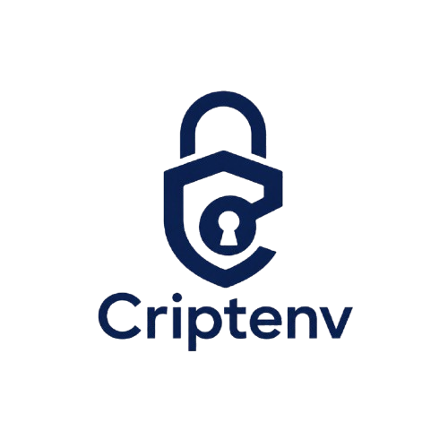

<p align="center">
  <picture>
    <source media="(prefers-color-scheme: dark)" srcset="apps/web/public/images/logocriptenv.png">
    <source media="(prefers-color-scheme: light)" srcset="apps/web/public/images/logocriptenv.png">
    
  </picture>
</p>

<h1 align="center">CriptEnv</h1>

<p align="center">
  <strong>Zero-Knowledge Secret Management Platform</strong><br>
  An open-source alternative to Doppler and Infisical for developers and teams.
</p>

<p align="center">
  <a href="https://opensource.org/licenses/MIT">
    
  </a>
  <a href="https://www.python.org/">
    
  </a>
  <a href="https://www.typescriptlang.org/">
    
  </a>
  <a href="https://fastapi.tiangolo.com/">
    
  </a>
  <a href="https://react.dev/">
    
  </a>
</p>

<p align="center">
  <a href="#-quick-start">Quick Start</a> •
  <a href="#-features">Features</a> •
  <a href="#-tech-stack">Tech Stack</a> •
  <a href="#-project-structure">Structure</a> •
  <a href="#-security">Security</a> •
  <a href="#-documentation">Docs</a> •
  <a href="#-contributing">Contributing</a>
</p>

---

## 🎯 The Problem: Secret Sprawl

Secrets — API keys, database credentials, tokens, certificates — are scattered across:

- `.env` files on multiple machines, frequently committed to Git accidentally
- Plain-text messages in Slack, Email, or WhatsApp
- Hosting dashboards (Vercel, Render, Railway) without central governance
- Generic password managers without DevOps context

**Impact**: 75% of breaches involve exposed credentials. Developers lose ~2.5 hours/week managing secrets. Compliance risks grow.

## 💡 The Solution

CriptEnv provides a **Zero-Knowledge** secret management platform where encryption happens **100% client-side**. The server never sees plaintext secrets — ever.

| Capability | Description |
|------------|-------------|
| 🔒 **Zero-Knowledge Encryption** | AES-256-GCM client-side. Server stores only encrypted blobs. |
| ⚡ **CLI-First Workflow** | Natural terminal experience: `set`, `get`, `push`, `pull`, `rotate` |
| 🌐 **Web Dashboard** | Visual interface for teams, audit logs, member management |
| 🔄 **Team Sync** | Secure sharing without plaintext exposure |
| 📋 **Audit Logs** | Complete trail of every secret operation |
| 🔑 **CI/CD Native** | GitHub Action, CI tokens, cloud integrations (Vercel, Render) |

---

## 🏗️ Architecture

### Zero-Knowledge Flow

```
User Password
    │
    ▼
PBKDF2HMAC-SHA256 (100,000 iterations)
    │
    ▼
Master Key ──► HKDF-SHA256 ──► Per-Environment Key
    │                              │
    ▼                              ▼
AES-256-GCM ◄───────────────── Plaintext Secret
    │
    ▼
Encrypted Blob ──► Server (never sees plaintext)
```

Even with full database access, secrets remain cryptographically secure.

---

## 🚀 Quick Start

### Prerequisites

- Python 3.11+
- Node.js 20+ (for web)
- PostgreSQL 14+ (or Docker)
- Redis (for production rate limiting)

### 1. Clone & Install

```bash
git clone https://github.com/77mdias/criptenv.git
cd criptenv
make install        # Installs web, api, and cli dependencies
```

### 2. Start the Backend (API)

```bash
# Using Make (recommended)
make api-dev

# Or manually
cd apps/api
python -m venv .venv
source .venv/bin/activate
pip install -r requirements.txt
uvicorn main:app --reload --port 8000
```

### 3. Start the Web Dashboard

```bash
# Using Make
make web-dev

# Or manually
cd apps/web
npm install
npm run dev           # Vinext dev server on http://localhost:3000
```

### 4. Use the CLI

```bash
cd apps/cli
pip install -e ".[dev]"

# Initialize local vault
criptenv init

# Login
criptenv login --email user@example.com

# Add secrets (encrypted locally)
criptenv set DATABASE_URL=postgres://...
criptenv set API_KEY=secret123

# List secrets (names only — values never exposed)
criptenv list

# Get decrypted value
criptenv get DATABASE_URL

# Sync with cloud
criptenv push -p <project-id>
criptenv pull -p <project-id>
```

### 5. Docker (Production-like)

```bash
# Development stack with hot-reload
make docker-dev

# Production build
make docker-build
make docker-up
```

---

## 🛠️ Tech Stack

### Backend (`apps/api`) — Python 3.11+

| Component | Technology | Purpose |
|-----------|------------|---------|
| Framework | FastAPI 0.115+ | Async REST API |
| ORM | SQLAlchemy 2.0+ (async) | Database abstraction |
| Driver | asyncpg 0.30+ | Async PostgreSQL |
| Validation | Pydantic 2.0+ | Request/response schemas |
| Auth | Custom JWT-like + OAuth 2.0 | Session tokens, GitHub/Google/Discord |
| 2FA | pyotp | TOTP-based two-factor auth |
| Email | resend | Transactional email |
| Scheduler | APScheduler 3.10+ | Background jobs |
| Rate Limit | Redis | Shared counters across workers |
| Migrations | Alembic | Schema management |

### CLI (`apps/cli`) — Python 3.10+

| Component | Technology | Purpose |
|-----------|------------|---------|
| Framework | Click 8.1+ | CLI commands |
| Encryption | cryptography 42+ | AES-256-GCM, PBKDF2, HKDF |
| HTTP Client | httpx 0.27+ | Async API client |
| Local DB | aiosqlite 0.20+ | SQLite vault (`~/.criptenv/vault.db`) |
| Build | hatchling | Python wheel build |

### Frontend (`apps/web`) — TypeScript

| Component | Technology | Purpose |
|-----------|------------|---------|
| Framework | Vinext 0.0.45 (Next.js 16.2.6 reimplementation) | Full-stack React |
| Runtime | React 19.2.5 | UI library |
| Styling | Tailwind CSS v4 | Utility-first CSS |
| Components | Radix UI 1.0+ | Accessible primitives |
| Forms | react-hook-form 7.74+ | Form handling |
| Validation | Zod 4.3+ | Schema validation |
| State | Zustand 5.0+ | Client state |
| Server State | @tanstack/react-query 5.100+ | API caching |
| Build | Vite 8.0+ | Bundler |
| Animation | GSAP, Framer Motion, Three.js | Marketing & UI effects |
| Deployment | Cloudflare Pages + Workers | Edge deployment |

### GitHub Action (`packages/github-action`)

| Component | Technology | Purpose |
|-----------|------------|---------|
| Runtime | Node.js 20 | GitHub Action runtime |
| Language | TypeScript | Action implementation |
| Bundling | ncc | Self-contained distribution |

### Infrastructure

| Service | Platform | Purpose |
|---------|----------|---------|
| Database | Supabase PostgreSQL | Primary data store |
| Backend | VPS Docker + Gunicorn | FastAPI server |
| API Tunnel | Cloudflare Tunnel | `criptenv-api.77mdevseven.tech` |
| Rate Limit | Redis (Docker) | Shared counters |
| Frontend | Cloudflare Pages + Workers | Vinext + Worker proxy |
| DNS | Cloudflare | Custom domains |

---

## 📂 Project Structure

```
criptenv/
├── apps/
│   ├── api/                  # FastAPI Backend (Python)
│   │   ├── main.py           # App entry point
│   │   ├── app/
│   │   │   ├── routers/      # FastAPI route handlers
│   │   │   ├── services/     # Business logic layer
│   │   │   ├── models/       # SQLAlchemy ORM models
│   │   │   ├── schemas/      # Pydantic request/response
│   │   │   ├── middleware/   # Auth, rate limit, CORS
│   │   │   └── strategies/   # Access control, integrations
│   │   ├── migrations/       # Alembic migrations
│   │   └── tests/            # 365 pytest tests
│   ├── cli/                  # Python CLI Application
│   │   ├── src/criptenv/
│   │   │   ├── commands/     # CLI commands (init, login, secrets, sync...)
│   │   │   ├── crypto/       # AES-256-GCM encryption
│   │   │   ├── vault/        # Local SQLite persistence
│   │   │   └── api/          # HTTP client
│   │   └── tests/            # 173 pytest tests
│   └── web/                  # Web Dashboard (TypeScript/Vinext)
│       ├── src/app/          # App Router (auth, dashboard, marketing)
│       ├── src/components/   # UI, shared, layout, marketing
│       ├── src/lib/api/      # API client modules
│       ├── src/stores/       # Zustand stores
│       └── tests/            # 41 Jest + 4 Cypress E2E tests
├── packages/
│   └── github-action/        # TypeScript GitHub Action
├── docs/                     # Complete documentation
│   ├── index.md              # Documentation index
│   ├── project/              # Overview, architecture, decisions
│   ├── technical/            # API, database, frontend, deployment
│   ├── features/             # Implemented, in-progress, backlog
│   ├── workflow/             # Development & agent workflows
│   └── development/          # CHANGELOG
├── deploy/
│   └── vps/                  # Docker Compose production stack
├── plans/                    # Implementation plans
├── specs/                    # Technical specifications
├── testsprite_tests/         # Automated endpoint tests
├── Makefile                  # Build orchestration
└── README.md                 # This file
```

---

## ✨ Features

### Phase 1 — CLI MVP ✅ Complete

| Command | Description |
|---------|-------------|
| `init` | Initialize local vault with master password |
| `login` / `logout` | Authenticate with backend (HTTP-only cookies) |
| `set` / `get` / `list` / `delete` | Full secret CRUD with client-side encryption |
| `push` / `pull` | Sync encrypted vault with cloud |
| `env` | Environment management |
| `projects` | Project management (create, list, rekey) |
| `import` / `export` | `.env` file import/export (JSON, CSV) |
| `doctor` | Diagnostic checks |
| `rotate` | Rotate secret values |
| `secrets expire` / `secrets alert` | Expiration and alerting |
| `ci login` / `ci deploy` | CI/CD workflow support |
| `integrations` | Cloud provider sync (Vercel, Render) |

### Phase 2 — Web UI ✅ Complete

| Feature | Description |
|---------|-------------|
| Landing Page | Marketing site with animations |
| Auth | Login, signup, forgot/reset password, OAuth (GitHub, Google, Discord) |
| 2FA/TOTP | QR-code setup, verification, disable |
| Dashboard | Project overview and analytics |
| Projects | CRUD, vault password, settings |
| Secrets | Browser with expiration badges, vault unlock |
| Audit Logs | Paginated timeline, CSV export |
| Team | Members, invites, role management |
| API Keys | Panel for public API access |
| Integrations | Vercel/Render connection dashboard |
| Account | Profile, password, OAuth account linking |

### Phase 3 — CI/CD & Integrations 🔄 ~92% Complete

| Feature | Status |
|---------|--------|
| GitHub Action | ✅ Complete |
| Public API (v1) | ✅ Complete — rate limiting, API keys, OpenAPI docs |
| CI Tokens | ✅ Complete |
| Secret Rotation & Alerts | ✅ API + CLI complete; Web partial |
| Cloud Integrations | ✅ Vercel + Render; Railway pending |
| Integration Config Encryption | ✅ AES-256-GCM at rest |
| OAuth (GitHub, Google, Discord) | ✅ Complete |
| Security Hardening (CR-01/CR-02) | ✅ HTTP-only cookies resolved |

### Phase 4 — Enterprise 📋 Planned

- SSO/SAML (Okta, Azure AD)
- SCIM provisioning
- SIEM export
- Self-hosted option

---

## 🧪 Testing

| Layer | Framework | Tests | Status |
|-------|-----------|-------|--------|
| **API Backend** | pytest | **365** | ✅ Passing |
| **CLI** | pytest | **173** | ✅ Passing |
| **Frontend Unit** | Jest + React Testing Library | **41** | ✅ Passing |
| **Frontend E2E** | Cypress | **4** | ✅ Passing |
| **Crypto Functions** | pytest | 30 | ✅ 100% coverage |

```bash
# Run all tests
make test

# Run specific suites
make api-test
make cli-test
make web-test-unit
make web-test-e2e
```

---

## 🔒 Security

- **Zero-Knowledge Architecture**: Server never sees plaintext secrets
- **AES-256-GCM**: Industry-standard authenticated encryption
- **PBKDF2HMAC-SHA256**: 100,000 iterations for master key derivation
- **HKDF-SHA256**: Per-environment key derivation
- **HTTP-Only Cookies**: Session tokens not exposed to JavaScript (XSS mitigation)
- **Rate Limiting**: Tiered limits (1000/200/100/5 per minute)
- **Audit Logs**: Complete traceability of all operations
- **Integration Config Encryption**: AES-256-GCM envelope encryption for provider credentials at rest

---

## 🌐 Deployment

### Production Stack

| Component | Platform | URL |
|-----------|----------|-----|
| **Frontend** | Cloudflare Pages + Workers | `https://criptenv.77mdevseven.tech` |
| **Backend API** | VPS Docker + Cloudflare Tunnel | `https://criptenv-api.77mdevseven.tech` |
| **Database** | Supabase PostgreSQL | Managed |
| **Rate Limit** | Redis (Docker) | VPS internal |

### Quick Deploy

```bash
# Backend (VPS)
cd deploy/vps
cp .env.example .env
# Edit .env with your values
docker compose up -d --build

# Frontend (Cloudflare)
cd apps/web
npm run build
npm run deploy
```

See [`docs/technical/deployment.md`](docs/technical/deployment.md) for full details.

---

## 📚 Documentation

CriptEnv maintains comprehensive documentation in `docs/`:

| Document | Description |
|----------|-------------|
| [`docs/index.md`](docs/index.md) | Documentation index and quick links |
| [`docs/project/current-state.md`](docs/project/current-state.md) | Development status, implemented features, risks |
| [`docs/project/architecture.md`](docs/project/architecture.md) | System architecture and component diagrams |
| [`docs/project/tech-stack.md`](docs/project/tech-stack.md) | Detailed technology breakdown |
| [`docs/project/decisions.md`](docs/project/decisions.md) | Technical decision log (ADR) |
| [`docs/technical/api.md`](docs/technical/api.md) | Backend API endpoints and patterns |
| [`docs/technical/frontend.md`](docs/technical/frontend.md) | Frontend structure and routing |
| [`docs/technical/deployment.md`](docs/technical/deployment.md) | Deploy instructions and infrastructure |
| [`docs/development/CHANGELOG.md`](docs/development/CHANGELOG.md) | Version history |

> **For AI Agents**: Read [`AGENTS.md`](AGENTS.md) before making any code changes.

---

## 🤝 Contributing

Contributions are welcome! Please read [`CONTRIBUTING.md`](CONTRIBUTING.md) for guidelines.

Quick guidelines:
- Branch naming: `feature/short-desc`, `bugfix/issue-number`, `chore/update-deps`
- Conventional Commits: `feat(cli): add new command`, `fix(api): resolve race condition`
- PR Process: Fill template → pass CI → 2 approvals → squash & merge

---

## 📄 License

MIT License — see [`LICENSE`](LICENSE) for details.

---

<p align="center">
  <strong>Built with 🔒 by developers, for developers.</strong><br>
  <a href="https://github.com/77mdias/criptenv">GitHub</a> •
  <a href="https://criptenv.77mdevseven.tech">Website</a>
</p>
