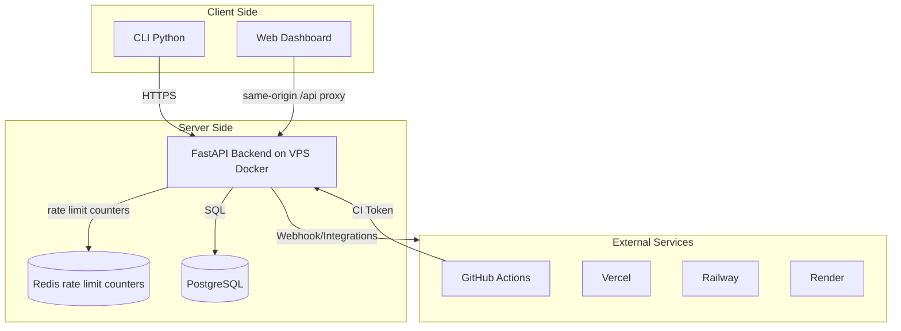
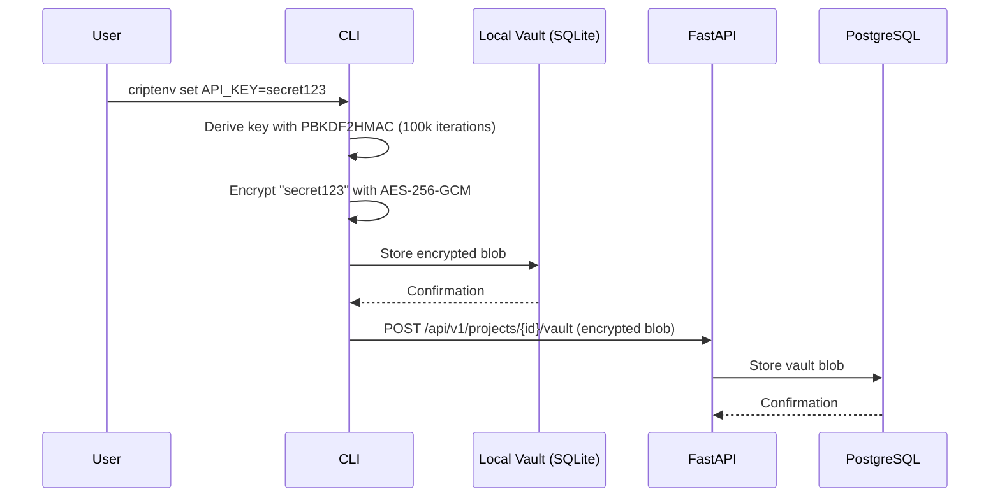
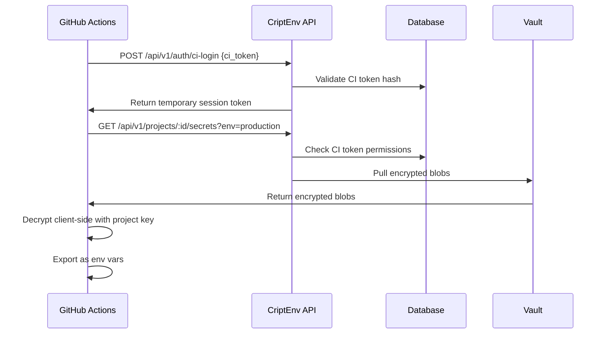

# Architecture — CriptEnv

## Overview

CriptEnv is a full-stack platform with three main components:



Production deployment uses Cloudflare Pages + Worker for the web app, a VPS-hosted Docker Compose stack for the API, Redis, DuckDNS updater, and Nginx Proxy Manager, and Supabase PostgreSQL as the external managed database. Render hosting artifacts remain only as rollback/legacy references; RenderProvider remains a product integration for user-owned Render services.

---

## Component Architecture

### 1. CLI (apps/cli)

```
apps/cli/src/criptenv/
├── __init__.py
├── cli.py              # Click CLI entry point
├── config.py           # Configuration management
├── context.py          # Context managers (cli_context, local_vault)
├── session.py          # Encrypted session management
├── api/
│   ├── __init__.py
│   ├── auth.py         # Auth endpoints client
│   ├── client.py       # CriptEnvClient (httpx async)
│   └── vault.py        # Vault endpoints client
├── commands/
│   ├── __init__.py
│   ├── ci.py          # CI/CD commands (ci-login, ci-deploy, ci-secrets)
│   ├── doctor.py       # Diagnostic command
│   ├── environments.py # env list, env create
│   ├── import_export.py # Import/export .env files
│   ├── init.py         # Initialize vault
│   ├── login.py        # Login/logout
│   ├── projects.py     # Project management
│   ├── secrets.py      # set, get, list, delete, rotate, expire, alert
│   └── sync.py         # push/pull
├── crypto/
│   ├── __init__.py
│   ├── core.py         # AES-256-GCM encryption
│   ├── keys.py         # Key derivation (PBKDF2HMAC + HKDF)
│   └── utils.py        # Utility functions
└── vault/
    ├── __init__.py
    ├── database.py     # SQLite operations
    ├── models.py       # Vault data models
    └── queries.py      # SQL queries
```

**Key Patterns**:
- Sync CLI commands use `cli_context()` async context manager
- Vault operations use `local_vault()` context manager
- All API calls go through `CriptEnvClient` class
- Encryption uses `cryptography` library with AES-256-GCM

---

### 2. Backend API (apps/api)

```
apps/api/
├── main.py              # FastAPI app, middleware, router inclusion
├── app/
│   ├── __init__.py
│   ├── config.py        # pydantic-settings, async DB URL parsing
│   ├── database.py      # SQLAlchemy async engine, session factory, Base
│   ├── middleware/
│   │   ├── auth.py      # Session token validation
│   │   └── jobs/
│   │       ├── __init__.py
│   │       ├── expiration_check.py  # Background job for expiring secrets
│   │       └── scheduler.py         # APScheduler lifecycle
│   ├── models/
│   │   ├── user.py
│   │   ├── project.py
│   │   ├── environment.py
│   │   ├── vault.py
│   │   ├── member.py     # Includes CIToken model
│   │   ├── audit.py
│   │   └── secret_expiration.py  # Phase 3
│   ├── routers/
│   │   ├── auth.py       # /api/auth/*
│   │   ├── projects.py   # /api/v1/projects
│   │   ├── environments.py
│   │   ├── vault.py      # push/pull/version
│   │   ├── members.py
│   │   ├── invites.py
│   │   ├── tokens.py     # CI/CD tokens
│   │   ├── audit.py
│   │   └── rotation.py   # Phase 3
│   ├── schemas/
│   │   ├── auth.py
│   │   ├── project.py
│   │   ├── vault.py
│   │   └── ...
│   ├── services/
│   │   ├── auth_service.py
│   │   ├── project_service.py
│   │   ├── vault_service.py
│   │   ├── audit_service.py
│   │   ├── rotation_service.py   # Phase 3
│   │   └── webhook_service.py    # Phase 3
│   └── strategies/
│       ├── access.py        # Vault access control
│       ├── invite_transitions.py
│       ├── vault_push.py
│       ├── audit_filters.py
│       └── integrations/     # Provider strategy pattern
│           ├── base.py
│           ├── vercel.py
│           ├── railway.py
│           └── render.py
└── tests/
    ├── test_auth_routes.py
    ├── test_ci_auth.py
    ├── test_rotation_routes.py
    └── ...
```

**Key Patterns**:
- Routers use `get_db()` dependency for session management
- All mutations go through service layer
- Strategy pattern for complex flows (access, invites, vault, audit)
- APScheduler for background jobs (expiration checks)

---

### 3. Frontend Web (apps/web)

```
apps/web/src/
├── app/
│   ├── layout.tsx           # Root layout, theme initialization
│   ├── globals.css          # TailwindCSS v4 + CSS variables
│   ├── (auth)/              # Auth route group
│   │   ├── login/page.tsx
│   │   ├── signup/page.tsx
│   │   └── forgot-password/page.tsx
│   ├── (dashboard)/         # Dashboard route group
│   │   ├── dashboard/page.tsx
│   │   ├── projects/
│   │   │   ├── page.tsx           # List
│   │   │   └── [id]/
│   │   │       ├── page.tsx       # Detail
│   │   │       ├── secrets/page.tsx
│   │   │       ├── audit/page.tsx
│   │   │       ├── members/page.tsx
│   │   │       └── settings/page.tsx
│   │   ├── account/page.tsx
│   │   └── integrations/page.tsx
│   └── (marketing)/        # Marketing route group
│       └── page.tsx         # Landing page
├── components/
│   ├── layout/              # Shell, sidebar-nav, top-nav, footer
│   ├── ui/                 # Radix UI primitive wrappers
│   └── marketing/          # Marketing-specific components
├── hooks/
│   ├── use-auth.ts
│   └── use-theme.ts
├── stores/
│   ├── auth.ts             # Zustand auth store
│   ├── crypto.ts           # Zustand crypto store (no persist)
│   └── ui.ts               # Zustand UI store
├── types/
│   └── index.ts
├── lib/
│   └── proxy.ts
└── proxy.ts
```

**State Management**:
- Zustand stores: `useUIStore`, `useProjectStore`
- React Query for server state
- Dark mode default with CSS variables
- Theme key in localStorage: `criptenv-theme`

---

## Data Flow

### Secret Creation Flow



### GitHub Action Flow (Phase 3)



---

## Security Architecture

### Zero-Knowledge Encryption

```
User Input (plain-text secret)
         │
         ▼
┌─────────────────────────┐
│  PBKDF2HMAC-SHA256      │
│  (100,000 iterations)   │──► Master Key
└─────────────────────────┘
         │
         ▼
┌─────────────────────────┐
│       HKDF-SHA256       │──► Per-Environment Key
└─────────────────────────┘
         │
         ▼
┌─────────────────────────┐
│      AES-256-GCM        │
│   (256-bit encryption)  │
└─────────────────────────┘
         │
         ▼
Encrypted Blob ──────────► Server (never sees plain-text)
```

### Authentication Layers

| Layer | Type | Storage | Purpose |
|-------|------|---------|---------|
| Session Token | JWT-like | HTTP-only cookie | Web dashboard auth |
| API Key | `cek_` prefix | Database hash | Public API auth |
| CI Token | `ci_` prefix | Database hash | CI/CD pipelines |

---

## Architectural Decisions

| Decision | Status | Impact |
|----------|--------|--------|
| Strategy pattern for integrations | ✅ Implemented | Extensible provider system |
| Service layer for business logic | ✅ Implemented | Testable, maintainable |
| Async SQLAlchemy with asyncpg | ✅ Implemented | Non-blocking DB operations |
| Route groups in Next.js | ✅ Implemented | Organized layouts |
| Zustand + React Query | ✅ Implemented | Clear state boundaries |
| APScheduler for background jobs | ✅ Implemented | Expiration checks |

---

**Document Version**: 1.0  
**Last Updated**: 2026-05-01
