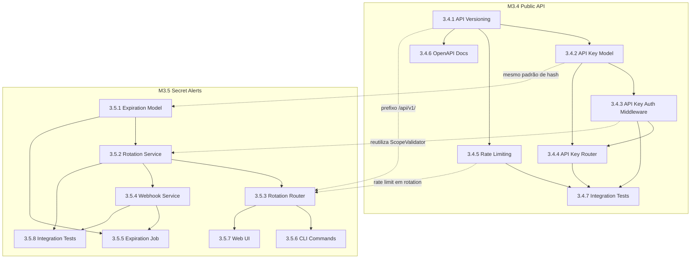

# HELL TDD Plan — M3.4 Public API + M3.5 Secret Alerts

## "Alta Coesão. Baixo Acoplamento. Sem piedade."

---

## 1. HELL Logic Gate (Pré-Implementação)

### 1.1 Information Expert

| Quem detém a informação?           | Responsável                                  |
| ---------------------------------- | -------------------------------------------- |
| API Keys (hash, scopes, expiração) | `APIKey` model → `ApiKeyService`             |
| Rate limit counters                | `RateLimitMiddleware` (in-memory/Redis)      |
| Secret expiração/rotação           | `SecretExpiration` model → `RotationService` |
| Webhook delivery state             | `WebhookDelivery` model → `WebhookService`   |
| Audit de todas as operações        | `AuditService` (existente)                   |

### 1.2 Pure Fabrication

| Abstração           | Justificativa                                            |
| ------------------- | -------------------------------------------------------- |
| `ApiKeyService`     | Media CRUD de API keys + hash + validação                |
| `RateLimitService`  | Abstrai estratégia de rate limiting (in-memory vs Redis) |
| `RotationService`   | Gerencia ciclo de vida de rotação de secrets             |
| `WebhookService`    | Media notificações para provedores externos              |
| `ExpirationChecker` | Job periódico que verifica expirações                    |

### 1.3 Protected Variations

| O que pode mudar?                            | Proteção                             |
| -------------------------------------------- | ------------------------------------ |
| Rate limit backend (memory → Redis)          | `RateLimitStrategy` interface        |
| Canal de notificação (email, webhook, slack) | `NotificationChannel` interface      |
| Formato de API key                           | Constante `API_KEY_PREFIX` + factory |
| Versão da API                                | Router prefix `/api/v1/` isolado     |

### 1.4 Indirection

| Comunicação                   | Mediador                               |
| ----------------------------- | -------------------------------------- |
| API key → User lookup         | `ApiKeyAuthMiddleware`                 |
| Expiração → Notificação       | `ExpirationChecker` → `WebhookService` |
| Rate limit → Response headers | `RateLimitMiddleware`                  |

### 1.5 Polymorphism

| Condicional complexa                       | Solução                               |
| ------------------------------------------ | ------------------------------------- |
| Auth method (session vs CI vs API key)     | Chain of Responsibility no middleware |
| Notification channel (webhook vs email)    | Strategy pattern                      |
| Rotation policy (manual vs notify vs auto) | Strategy pattern                      |

---

## 2. Ciclo HELL por Milestone

```
SPEC ──► TDD ──► REFACTOR ──► EVOLVE
  │        │          │           │
 Gate    Gate       Gate        Gate
 REQ     TEST      AUDIT      DEPLOY
```

---

## 3. M3.4: Public API — HELL TDD Breakdown

### 3.4.1 — API Versioning

**SPEC**: Todos os endpoints devem ser acessíveis via prefixo `/api/v1/`. Endpoints legacy mantidos em `/` para backwards compatibility.

**TDD RED**:

```python
# apps/api/tests/test_api_versioning.py

async def test_v1_health_endpoint():
    """GET /api/v1/health deve retornar 200 com version info."""
    response = await client.get("/api/v1/health")
    assert response.status_code == 200
    assert response.json()["version"] == "1.0"
    assert response.headers["X-API-Version"] == "1.0"

async def test_v1_projects_endpoint():
    """GET /api/v1/projects deve funcionar igual a /projects."""
    response = await client.get("/api/v1/projects")
    assert response.status_code in (200, 401)  # auth required

async def test_invalid_version_returns_400():
    """GET /api/v2/health deve retornar 400."""
    response = await client.get("/api/v2/health")
    assert response.status_code == 400

async def test_legacy_endpoints_still_work():
    """GET /health deve continuar funcionando."""
    response = await client.get("/health")
    assert response.status_code == 200
```

**GREEN**: Modificar [`main.py`](apps/api/main.py) para criar sub-app com prefixo `/api/v1/`:

```python
# Criar APIRouter com prefixo /api/v1
from fastapi import APIRouter
v1_router = APIRouter(prefix="/api/v1")
# Incluir todos os routers existentes no v1_router
# Montar v1_router no app principal
# Manter routers legacy em / para backwards compat
```

**REFACTOR**: Extrair configuração de versioning para [`app/config.py`](apps/api/app/config.py).

**Arquivos**:

- [`apps/api/main.py`](apps/api/main.py) — MODIFY
- [`apps/api/tests/test_api_versioning.py`](apps/api/tests/test_api_versioning.py) — CREATE

---

### 3.4.2 — API Key Model + Schema

**SPEC**: API keys com formato `cek_<prefix><random>`, hash SHA-256, scopes, expiração opcional.

**TDD RED**:

```python
# apps/api/tests/test_api_key_model.py

async def test_api_key_creation():
    """APIKey deve ser criado com campos obrigatórios."""
    key = APIKey(
        user_id=user_id,
        project_id=project_id,
        name="CI Pipeline",
        key_hash=hash_api_key("cek_live_abc123"),
        prefix="cek_live_",
        scopes=["read:secrets"]
    )
    assert key.name == "CI Pipeline"
    assert key.prefix == "cek_live_"
    assert key.scopes == ["read:secrets"]

async def test_api_key_schema_validation():
    """ApiKeyCreate schema deve validar nome e scopes."""
    schema = ApiKeyCreate(name="", scopes=[])
    with pytest.raises(ValidationError):
        schema.validate()

async def test_api_key_hash_consistency():
    """Mesma key deve gerar mesmo hash."""
    key = "cek_live_abc123"
    assert hash_api_key(key) == hash_api_key(key)

async def test_api_key_different_hashes():
    """Keys diferentes devem gerar hashes diferentes."""
    assert hash_api_key("cek_live_abc") != hash_api_key("cek_live_xyz")
```

**GREEN**: Criar [`apps/api/app/models/api_key.py`](apps/api/app/models/api_key.py) e [`apps/api/app/schemas/api_key.py`](apps/api/app/schemas/api_key.py).

**REFACTOR**: Extrair `hash_api_key` para utilidade compartilhada com CI auth.

**Arquivos**:

- [`apps/api/app/models/api_key.py`](apps/api/app/models/api_key.py) — CREATE
- [`apps/api/app/schemas/api_key.py`](apps/api/app/schemas/api_key.py) — CREATE
- [`apps/api/tests/test_api_key_model.py`](apps/api/tests/test_api_key_model.py) — CREATE

---

### 3.4.3 — API Key Auth Middleware

**SPEC**: Middleware que extrai API key do header `Authorization: Bearer cek_...`, valida hash, verifica expiração, e retorna user associado.

**TDD RED**:

```python
# apps/api/tests/test_api_key_auth.py

async def test_valid_api_key_authenticates():
    """API key válida deve retornar user associado."""
    user = await get_api_key_user(request_with_valid_key)
    assert user is not None
    assert user.id == expected_user_id

async def test_expired_api_key_returns_401():
    """API key expirada deve retornar 401."""
    with pytest.raises(HTTPException) as exc:
        await get_api_key_user(request_with_expired_key)
    assert exc.value.status_code == 401
    assert "expired" in exc.value.detail.lower()

async def test_revoked_api_key_returns_none():
    """API key revogada deve retornar None (fallback para session auth)."""
    user = await get_api_key_user(request_with_revoked_key)
    assert user is None

async def test_non_cek_prefix_ignored():
    """Tokens sem prefixo cek_ devem ser ignorados (deixar para session auth)."""
    user = await get_api_key_user(request_with_session_token)
    assert user is None

async def test_api_key_updates_last_used_at():
    """Uso de API key deve atualizar last_used_at."""
    await get_api_key_user(request_with_valid_key)
    # Verificar que last_used_at foi atualizado

async def test_api_key_scope_check():
    """Verificar se token tem scope necessário."""
    validator = ScopeValidator()
    assert validator.has_scope(["read:secrets"], "read:secrets") is True
    assert validator.has_scope(["read:secrets"], "write:secrets") is False
    assert validator.has_scope(["admin:project"], "write:secrets") is True
```

**GREEN**: Criar [`apps/api/app/middleware/api_key_auth.py`](apps/api/app/middleware/api_key_auth.py).

**REFACTOR**: Reutilizar `ScopeValidator` do [`ci_auth.py`](apps/api/app/middleware/ci_auth.py:38) — extrair para módulo compartilhado.

**Arquivos**:

- [`apps/api/app/middleware/api_key_auth.py`](apps/api/app/middleware/api_key_auth.py) — CREATE
- [`apps/api/tests/test_api_key_auth.py`](apps/api/tests/test_api_key_auth.py) — CREATE

---

### 3.4.4 — API Key Router (CRUD)

**SPEC**: Endpoints para criar, listar, revogar API keys. Plaintext mostrado apenas na criação.

**TDD RED**:

```python
# apps/api/tests/test_api_key_routes.py

async def test_create_api_key():
    """POST /api/v1/api-keys deve criar key e retornar plaintext uma vez."""
    response = await client.post("/api/v1/api-keys", json={
        "name": "CI Pipeline",
        "scopes": ["read:secrets"],
        "expires_in_days": 90
    })
    assert response.status_code == 201
    data = response.json()
    assert data["key"].startswith("cek_")  # plaintext só aqui
    assert data["name"] == "CI Pipeline"
    assert "key_hash" not in data  # hash nunca exposto

async def test_list_api_keys_no_plaintext():
    """GET /api/v1/api-keys deve listar keys SEM expor plaintext."""
    response = await client.get("/api/v1/api-keys")
    assert response.status_code == 200
    for key_data in response.json()["items"]:
        assert "key" not in key_data
        assert "key_hash" not in key_data
        assert "prefix" in key_data  # apenas prefixo para identificação

async def test_revoke_api_key():
    """DELETE /api/v1/api-keys/:id deve revogar key."""
    response = await client.delete(f"/api/v1/api-keys/{key_id}")
    assert response.status_code == 200
    # Verificar que key não funciona mais
    auth_response = await client.get("/api/v1/projects",
        headers={"Authorization": f"Bearer {key_plaintext}"})
    assert auth_response.status_code == 401

async def test_create_api_key_requires_auth():
    """POST /api/v1/api-keys sem auth deve retornar 401."""
    response = await client.post("/api/v1/api-keys", json={"name": "test"})
    assert response.status_code == 401

async def test_create_api_key_audit_logged():
    """Criação de API key deve gerar audit log."""
    await create_api_key(...)
    # Verificar audit log com action="api_key.created"
```

**GREEN**: Criar [`apps/api/app/routers/api_keys.py`](apps/api/app/routers/api_keys.py) e [`apps/api/app/services/api_key_service.py`](apps/api/app/services/api_key_service.py).

**REFACTOR**: Padrão de resposta consistente com outros routers.

**Arquivos**:

- [`apps/api/app/routers/api_keys.py`](apps/api/app/routers/api_keys.py) — CREATE
- [`apps/api/app/services/api_key_service.py`](apps/api/app/services/api_key_service.py) — CREATE
- [`apps/api/tests/test_api_key_routes.py`](apps/api/tests/test_api_key_routes.py) — CREATE

---

### 3.4.5 — Rate Limiting Middleware

**SPEC**: Rate limiting com slowapi, headers `X-RateLimit-*`, limites diferentes por tipo de auth.

**TDD RED**:

```python
# apps/api/tests/test_rate_limit.py

async def test_rate_limit_headers_present():
    """Respostas devem incluir headers X-RateLimit-*."""
    response = await client.get("/api/v1/health")
    assert "X-RateLimit-Limit" in response.headers
    assert "X-RateLimit-Remaining" in response.headers
    assert "X-RateLimit-Reset" in response.headers

async def test_rate_limit_auth_endpoints():
    """Auth endpoints: 5 req/min por IP."""
    for i in range(5):
        await client.post("/api/v1/auth/login", json={...})
    response = await client.post("/api/v1/auth/login", json={...})
    assert response.status_code == 429
    assert response.json()["error"]["code"] == "RATE_LIMIT_EXCEEDED"

async def test_rate_limit_api_key_endpoints():
    """API key endpoints: 1000 req/min por key."""
    # Testar com muitas requests usando API key
    ...

async def test_rate_limit_different_per_auth_method():
    """Limites diferentes para session vs API key vs CI token."""
    # Session: 100/min, API key: 1000/min, CI: 200/min
    ...

async def test_rate_limit_429_response_format():
    """429 deve ter formato de erro consistente."""
    response = await client.get("/api/v1/health")  # após exceder
    assert response.status_code == 429
    data = response.json()
    assert "error" in data
    assert data["error"]["code"] == "RATE_LIMIT_EXCEEDED"
    assert "retry_after" in data["error"]
```

**GREEN**: Criar [`apps/api/app/middleware/rate_limit.py`](apps/api/app/middleware/rate_limit.py) com slowapi.

**REFACTOR**: Extrair `RateLimitStrategy` para permitir swap memory → Redis.

**Arquivos**:

- [`apps/api/app/middleware/rate_limit.py`](apps/api/app/middleware/rate_limit.py) — CREATE
- [`apps/api/tests/test_rate_limit.py`](apps/api/tests/test_rate_limit.py) — CREATE
- [`apps/api/requirements.txt`](apps/api/requirements.txt) — MODIFY (adicionar slowapi)

---

### 3.4.6 — OpenAPI/Swagger Customizado + Error Format

**SPEC**: Swagger UI em `/docs`, ReDoc em `/redoc`, formato de erro consistente.

**TDD RED**:

```python
# apps/api/tests/test_api_docs.py

async def test_swagger_ui_available_in_dev():
    """GET /docs deve retornar Swagger UI em desenvolvimento."""
    response = await client.get("/docs")
    assert response.status_code == 200

async def test_redoc_available():
    """GET /redoc deve retornar ReDoc."""
    response = await client.get("/redoc")
    assert response.status_code == 200

async def test_openapi_spec_has_security_schemes():
    """OpenAPI spec deve documentar security schemes."""
    spec = app.openapi()
    assert "securitySchemes" in spec["components"]
    assert "BearerAuth" in spec["components"]["securitySchemes"]

async def test_error_response_format():
    """Erros devem seguir formato { error: { code, message, details } }."""
    response = await client.get("/api/v1/projects/nonexistent")
    data = response.json()
    assert "error" in data
    assert "code" in data["error"]
    assert "message" in data["error"]
```

**GREEN**: Customizar OpenAPI em [`main.py`](apps/api/main.py) e criar error handler global.

**REFACTOR**: Extrair `APIError` e `ErrorResponse` para [`app/schemas/errors.py`](apps/api/app/schemas/errors.py).

**Arquivos**:

- [`apps/api/app/schemas/errors.py`](apps/api/app/schemas/errors.py) — CREATE
- [`apps/api/main.py`](apps/api/main.py) — MODIFY
- [`apps/api/tests/test_api_docs.py`](apps/api/tests/test_api_docs.py) — CREATE

---

### 3.4.7 — Testes de Integração Completos (Public API)

**SPEC**: Testes E2E cobrindo fluxo completo: criar API key → autenticar → usar endpoints → rate limit → revogar.

**TDD**:

```python
# apps/api/tests/test_public_api_integration.py

async def test_full_api_key_lifecycle():
    """Fluxo completo: criar key → usar → revogar."""
    # 1. Login com session
    # 2. Criar API key
    # 3. Usar API key para listar projects
    # 4. Usar API key para pull secrets
    # 5. Revogar API key
    # 6. Verificar que key não funciona mais

async def test_api_key_with_scoped_access():
    """API key com scope limitado deve respeitar permissões."""
    # Criar key com scope read:secrets
    # Tentar write:secrets → deve falhar
    # Ler secrets → deve funcionar

async def test_rate_limit_across_requests():
    """Rate limit deve persistir entre requests."""
    # Fazer N requests até próximo do limite
    # Verificar headers decrescendo
    # Exceder limite → 429

async def test_concurrent_api_key_usage():
    """Múltiplas requests simultâneas com mesma key."""
    # asyncio.gather de N requests
    # Todas devem funcionar (dentro do rate limit)
```

**Arquivos**:

- [`apps/api/tests/test_public_api_integration.py`](apps/api/tests/test_public_api_integration.py) — CREATE

---

## 4. M3.5: Secret Alerts & Rotation — HELL TDD Breakdown

### 3.5.1 — SecretExpiration Model + Schema

**SPEC**: Model que associa secret_key + environment com data de expiração, política de rotação e configuração de notificação.

**TDD RED**:

```python
# apps/api/tests/test_secret_expiration_model.py

async def test_expiration_creation():
    """SecretExpiration deve ser criado com campos obrigatórios."""
    exp = SecretExpiration(
        project_id=project_id,
        environment_id=env_id,
        secret_key="DATABASE_URL",
        expires_at=datetime(2026, 7, 1, tzinfo=timezone.utc),
        rotation_policy="notify",
        notify_days_before=7
    )
    assert exp.secret_key == "DATABASE_URL"
    assert exp.rotation_policy == "notify"

async def test_expiration_unique_per_env_key():
    """Mesma key no mesmo env não pode ter duas expirações."""
    # Criar primeira expiração
    # Tentar criar segunda → deve falhar com IntegrityError

async def test_expiration_schema_validation():
    """Schema deve validar rotation_policy."""
    with pytest.raises(ValidationError):
        SecretExpirationCreate(rotation_policy="invalid")

async def test_expiration_defaults():
    """Defaults: rotation_policy='manual', notify_days_before=7."""
    exp = SecretExpiration(
        project_id=project_id,
        environment_id=env_id,
        secret_key="KEY",
        expires_at=datetime.now(timezone.utc) + timedelta(days=90)
    )
    assert exp.rotation_policy == "manual"
    assert exp.notify_days_before == 7
```

**GREEN**: Criar model e schema.

**REFACTOR**: Índices compostos para queries eficientes.

**Arquivos**:

- [`apps/api/app/models/secret_expiration.py`](apps/api/app/models/secret_expiration.py) — CREATE
- [`apps/api/app/schemas/secret_expiration.py`](apps/api/app/schemas/secret_expiration.py) — CREATE
- [`apps/api/tests/test_secret_expiration_model.py`](apps/api/tests/test_secret_expiration_model.py) — CREATE

---

### 3.5.2 — Rotation Service

**SPEC**: Serviço que gerencia rotação de secrets — cria nova versão, marca antiga como rotacionada, registra no audit.

**TDD RED**:

```python
# apps/api/tests/test_rotation_service.py

async def test_rotate_secret_creates_new_version():
    """Rotação deve criar nova versão do secret."""
    service = RotationService(db)
    result = await service.rotate_secret(
        project_id=project_id,
        environment_id=env_id,
        secret_key="DATABASE_URL",
        new_value_encrypted={...},
        user_id=user_id
    )
    assert result.new_version == old_version + 1

async def test_rotate_secret_marks_old_as_rotated():
    """Secret antigo deve ser marcado com rotated_at."""
    await service.rotate_secret(...)
    old_exp = await get_expiration(secret_key="DATABASE_URL")
    assert old_exp.rotated_at is not None

async def test_rotate_secret_audit_logged():
    """Rotação deve gerar audit log."""
    await service.rotate_secret(...)
    logs = await audit_service.get_project_logs(project_id, action="secret.rotated")
    assert len(logs) == 1

async def test_rotate_secret_requires_membership():
    """Usuário sem membership não pode rotacionar."""
    with pytest.raises(PermissionError):
        await service.rotate_secret(..., user_id=non_member_id)

async def test_set_expiration():
    """Definir expiração em secret existente."""
    await service.set_expiration(
        project_id=project_id,
        environment_id=env_id,
        secret_key="DATABASE_URL",
        expires_at=datetime(2026, 12, 31, tzinfo=timezone.utc),
        rotation_policy="notify",
        notify_days_before=14
    )
    exp = await get_expiration(secret_key="DATABASE_URL")
    assert exp.notify_days_before == 14

async def test_get_expiring_secrets():
    """Listar secrets que expiram dentro de N dias."""
    expiring = await service.get_expiring_secrets(
        project_id=project_id,
        within_days=30
    )
    assert len(expiring) > 0
```

**GREEN**: Criar [`apps/api/app/services/rotation_service.py`](apps/api/app/services/rotation_service.py).

**REFACTOR**: Separar lógica de notificação em `WebhookService`.

**Arquivos**:

- [`apps/api/app/services/rotation_service.py`](apps/api/app/services/rotation_service.py) — CREATE
- [`apps/api/tests/test_rotation_service.py`](apps/api/tests/test_rotation_service.py) — CREATE

---

### 3.5.3 — Rotation Router

**SPEC**: Endpoints para rotacionar secrets, configurar expiração, listar pendências.

**TDD RED**:

```python
# apps/api/tests/test_rotation_routes.py

async def test_rotate_secret_endpoint():
    """POST /api/v1/projects/:id/environments/:env/secrets/:key/rotate"""
    response = await client.post(
        f"/api/v1/projects/{pid}/environments/{eid}/secrets/DATABASE_URL/rotate",
        json={"new_value": encrypted_value, "iv": "...", "auth_tag": "..."},
        headers=auth_headers
    )
    assert response.status_code == 200
    assert "rotation_id" in response.json()
    assert response.json()["new_version"] > 0

async def test_set_expiration_endpoint():
    """POST /api/v1/projects/:id/environments/:env/secrets/:key/expiration"""
    response = await client.post(
        f"/api/v1/projects/{pid}/environments/{eid}/secrets/DATABASE_URL/expiration",
        json={
            "expires_at": "2026-12-31T00:00:00Z",
            "rotation_policy": "notify",
            "notify_days_before": 14
        },
        headers=auth_headers
    )
    assert response.status_code == 201

async def test_get_rotation_status():
    """GET /api/v1/projects/:id/environments/:env/secrets/:key/rotation"""
    response = await client.get(
        f"/api/v1/projects/{pid}/environments/{eid}/secrets/DATABASE_URL/rotation",
        headers=auth_headers
    )
    assert response.status_code == 200
    data = response.json()
    assert "current_version" in data
    assert "expires_at" in data
    assert "rotation_policy" in data

async def test_list_expiring_secrets():
    """GET /api/v1/projects/:id/secrets/expiring?days=30"""
    response = await client.get(
        f"/api/v1/projects/{pid}/secrets/expiring?days=30",
        headers=auth_headers
    )
    assert response.status_code == 200
    assert isinstance(response.json()["items"], list)

async def test_rotate_requires_write_scope():
    """Rotação requer scope write:secrets."""
    response = await client.post(
        f"/api/v1/projects/{pid}/environments/{eid}/secrets/KEY/rotate",
        json={...},
        headers=read_only_headers  # API key com scope read:secrets
    )
    assert response.status_code == 403
```

**GREEN**: Criar router de rotação.

**REFACTOR**: Middleware de verificação de scope reutilizável.

**Arquivos**:

- [`apps/api/app/routers/rotation.py`](apps/api/app/routers/rotation.py) — CREATE
- [`apps/api/tests/test_rotation_routes.py`](apps/api/tests/test_rotation_routes.py) — CREATE

---

### 3.5.4 — Webhook Service

**SPEC**: Serviço que envia notificações via webhook quando secrets estão próximos da expiração.

**TDD RED**:

```python
# apps/api/tests/test_webhook_service.py

async def test_send_webhook_notification():
    """Webhook deve enviar POST para URL configurada."""
    service = WebhookService()
    with httpx_mock() as mock:
        mock.add_response(url="https://hooks.example.com/notify", method="POST")
        result = await service.notify(
            webhook_url="https://hooks.example.com/notify",
            event="secret.expiring",
            payload={
                "project_id": str(project_id),
                "environment": "production",
                "secret_key": "DATABASE_URL",
                "expires_at": "2026-07-01T00:00:00Z"
            }
        )
        assert result.success is True

async def test_webhook_retry_on_failure():
    """Webhook deve retry 3 vezes com backoff exponencial."""
    service = WebhookService()
    with httpx_mock() as mock:
        mock.add_response(status_code=500)  # primeira tentativa
        mock.add_response(status_code=500)  # segunda tentativa
        mock.add_response(status_code=200)  # terceira tentativa
        result = await service.notify(...)
        assert result.attempts == 3
        assert result.success is True

async def test_webhook_payload_format():
    """Payload deve seguir formato documentado."""
    payload = service.build_payload(
        event="secret.expiring",
        project_id=project_id,
        environment="production",
        secret_key="DATABASE_URL",
        expires_at=datetime(2026, 7, 1, tzinfo=timezone.utc)
    )
    assert payload["event"] == "secret.expiring"
    assert "timestamp" in payload
    assert "secret_key" in payload
    assert "secret_value" not in payload  # NUNCA incluir valor

async def test_webhook_delivery_logged():
    """Entrega de webhook deve ser logada no audit."""
    await service.notify(...)
    logs = await audit_service.get_project_logs(
        project_id, action="webhook.delivered"
    )
    assert len(logs) >= 1
```

**GREEN**: Criar [`apps/api/app/services/webhook_service.py`](apps/api/app/services/webhook_service.py).

**REFACTOR**: Interface `NotificationChannel` para suportar email/slack no futuro.

**Arquivos**:

- [`apps/api/app/services/webhook_service.py`](apps/api/app/services/webhook_service.py) — CREATE
- [`apps/api/tests/test_webhook_service.py`](apps/api/tests/test_webhook_service.py) — CREATE

---

### 3.5.5 — Background Job (Expiration Checker)

**SPEC**: Job que roda a cada hora, verifica secrets próximos da expiração, e dispara notificações.

**TDD RED**:

```python
# apps/api/tests/test_expiration_check.py

async def test_expiration_check_finds_expiring_secrets():
    """Job deve encontrar secrets expirando dentro de notify_days."""
    checker = ExpirationChecker(db, webhook_service)
    # Criar secret que expira em 5 dias (notify_days=7)
    expiring = await checker.check_expirations()
    assert len(expiring) > 0

async def test_expiration_check_skips_already_notified():
    """Não re-notificar se notificado nas últimas 24h."""
    checker = ExpirationChecker(db, webhook_service)
    # Marcar last_notified_at = agora
    expiring = await checker.check_expirations()
    # Secret não deve aparecer

async def test_expiration_check_skips_rotated():
    """Secrets já rotacionados não devem ser verificados."""
    checker = ExpirationChecker(db, webhook_service)
    # Marcar rotated_at = agora
    expiring = await checker.check_expirations()
    # Secret não deve aparecer

async def test_expiration_check_idempotent():
    """Múltiplas execuções não devem duplicar notificações."""
    checker = ExpirationChecker(db, webhook_service)
    await checker.check_expirations()
    await checker.check_expirations()
    # Verificar que notificação foi enviada apenas uma vez
```

**GREEN**: Criar [`apps/api/app/jobs/expiration_check.py`](apps/api/app/jobs/expiration_check.py).

**REFACTOR**: Configurar APScheduler no lifespan do FastAPI.

**Arquivos**:

- [`apps/api/app/jobs/expiration_check.py`](apps/api/app/jobs/expiration_check.py) — CREATE
- [`apps/api/tests/test_expiration_check.py`](apps/api/tests/test_expiration_check.py) — CREATE
- [`apps/api/main.py`](apps/api/main.py) — MODIFY (adicionar scheduler no lifespan)

---

### 3.5.6 — CLI Commands (rotate, expire, alert, rotation list)

**SPEC**: Comandos CLI para rotação manual, configuração de expiração, e listagem.

**TDD RED**:

```python
# apps/cli/tests/test_rotation_commands.py

def test_rotate_command():
    """criptenv rotate KEY --env production deve rotacionar secret."""
    result = runner.invoke(cli, ["rotate", "DATABASE_URL", "--env", "production"])
    assert result.exit_code == 0
    assert "rotated" in result.output.lower()

def test_rotate_command_with_value():
    """criptenv rotate KEY --env production --value NEW_VALUE."""
    result = runner.invoke(cli, [
        "rotate", "DATABASE_URL", "--env", "production",
        "--value", "new_secret_value"
    ])
    assert result.exit_code == 0

def test_expire_command():
    """criptenv secrets expire KEY --days 90 deve definir expiração."""
    result = runner.invoke(cli, [
        "secrets", "expire", "DATABASE_URL",
        "--days", "90", "--env", "production"
    ])
    assert result.exit_code == 0
    assert "90 days" in result.output

def test_expire_command_with_policy():
    """criptenv secrets expire KEY --days 90 --policy notify."""
    result = runner.invoke(cli, [
        "secrets", "expire", "DATABASE_URL",
        "--days", "90", "--policy", "notify"
    ])
    assert result.exit_code == 0

def test_rotation_list_command():
    """criptenv rotation list --env production deve listar pendências."""
    result = runner.invoke(cli, [
        "rotation", "list", "--env", "production"
    ])
    assert result.exit_code == 0
```

**GREEN**: Adicionar comandos em [`apps/cli/src/criptenv/commands/secrets.py`](apps/cli/src/criptenv/commands/secrets.py).

**REFACTOR**: Extrair helpers de formatação de output.

**Arquivos**:

- [`apps/cli/src/criptenv/commands/secrets.py`](apps/cli/src/criptenv/commands/secrets.py) — MODIFY
- [`apps/cli/tests/test_rotation_commands.py`](apps/cli/tests/test_rotation_commands.py) — CREATE

---

### 3.5.7 — Web UI (Expiration Badges + Alert Config)

**SPEC**: Badges de expiração na tabela de secrets, configuração de webhooks no settings do projeto.

**TDD RED**:

```typescript
// apps/web/src/components/shared/__tests__/secret-row.test.tsx

test('shows expiration badge when secret expires in 5 days', () => {
  render(<SecretRow secret={secretExpiringIn5Days} />)
  expect(screen.getByText(/expires in 5 days/i)).toBeInTheDocument()
})

test('shows red badge for expired secrets', () => {
  render(<SecretRow secret={expiredSecret} />)
  expect(screen.getByText(/expired/i)).toHaveClass('text-red-500')
})

test('shows no badge when no expiration set', () => {
  render(<SecretRow secret={secretWithoutExpiration} />)
  expect(screen.queryByText(/expires/i)).not.toBeInTheDocument()
})
```

**GREEN**: Modificar [`apps/web/src/components/shared/secret-row.tsx`](apps/web/src/components/shared/secret-row.tsx) e criar componente de configuração de alertas.

**REFACTOR**: Extrair `ExpirationBadge` como componente reutilizável.

**Arquivos**:

- [`apps/web/src/components/shared/secret-row.tsx`](apps/web/src/components/shared/secret-row.tsx) — MODIFY
- [`apps/web/src/components/shared/expiration-badge.tsx`](apps/web/src/components/shared/expiration-badge.tsx) — CREATE
- [`apps/web/src/app/(dashboard)/projects/[id]/settings/page.tsx`](<apps/web/src/app/(dashboard)/projects/[id]/settings/page.tsx>) — MODIFY

---

### 3.5.8 — Testes de Integração Completos (Secret Alerts)

**SPEC**: Testes E2E cobrindo fluxo completo: definir expiração → verificar → notificar → rotacionar.

**TDD**:

```python
# apps/api/tests/test_secret_alerts_integration.py

async def test_full_expiration_lifecycle():
    """Fluxo completo: set expiration → check → notify → rotate."""
    # 1. Definir expiração em secret
    # 2. Rodar expiration check
    # 3. Verificar que webhook foi chamado
    # 4. Rotacionar secret via API
    # 5. Verificar que expiração antiga tem rotated_at
    # 6. Verificar audit logs

async def test_webhook_configuration_per_project():
    """Configurar webhook por projeto e receber notificação."""
    # 1. Configurar webhook URL no projeto
    # 2. Definir expiração em secret
    # 3. Rodar check
    # 4. Verificar POST no webhook URL

async def test_rotation_preserves_audit_trail():
    """Rotação deve manter trail completo no audit."""
    # 1. Criar secret
    # 2. Definir expiração
    # 3. Rotacionar
    # 4. Verificar audit: secret.created, expiration.set, secret.rotated
```

**Arquivos**:

- [`apps/api/tests/test_secret_alerts_integration.py`](apps/api/tests/test_secret_alerts_integration.py) — CREATE

---

## 5. Diagrama de Dependências



---

## 6. Ordem de Execução TDD

### Sprint 1: M3.4 Foundation

1. **3.4.1** API Versioning (RED → GREEN → REFACTOR)
2. **3.4.2** API Key Model + Schema (RED → GREEN → REFACTOR)
3. **3.4.3** API Key Auth Middleware (RED → GREEN → REFACTOR)

### Sprint 2: M3.4 Core

4. **3.4.4** API Key Router CRUD (RED → GREEN → REFACTOR)
5. **3.4.5** Rate Limiting Middleware (RED → GREEN → REFACTOR)
6. **3.4.6** OpenAPI + Error Format (RED → GREEN → REFACTOR)

### Sprint 3: M3.4 Integration + M3.5 Foundation

7. **3.4.7** Public API Integration Tests
8. **3.5.1** SecretExpiration Model (RED → GREEN → REFACTOR)
9. **3.5.2** Rotation Service (RED → GREEN → REFACTOR)

### Sprint 4: M3.5 Core

10. **3.5.3** Rotation Router (RED → GREEN → REFACTOR)
11. **3.5.4** Webhook Service (RED → GREEN → REFACTOR)
12. **3.5.5** Expiration Background Job (RED → GREEN → REFACTOR)

### Sprint 5: M3.5 Extensions

13. **3.5.6** CLI Commands (RED → GREEN → REFACTOR)
14. **3.5.7** Web UI Badges + Config (RED → GREEN → REFACTOR)
15. **3.5.8** Secret Alerts Integration Tests

---

## 7. Novos Arquivos Resumo

### M3.4 — Public API

| Arquivo                                         | Tipo   | Descrição                              |
| ----------------------------------------------- | ------ | -------------------------------------- |
| `apps/api/app/models/api_key.py`                | CREATE | Model SQLAlchemy para API keys         |
| `apps/api/app/schemas/api_key.py`               | CREATE | Pydantic schemas para API keys         |
| `apps/api/app/schemas/errors.py`                | CREATE | Formato padronizado de erros           |
| `apps/api/app/middleware/api_key_auth.py`       | CREATE | Middleware de autenticação por API key |
| `apps/api/app/middleware/rate_limit.py`         | CREATE | Middleware de rate limiting            |
| `apps/api/app/routers/api_keys.py`              | CREATE | CRUD de API keys                       |
| `apps/api/app/services/api_key_service.py`      | CREATE | Lógica de negócio de API keys          |
| `apps/api/tests/test_api_versioning.py`         | CREATE | Testes de versionamento                |
| `apps/api/tests/test_api_key_model.py`          | CREATE | Testes do model                        |
| `apps/api/tests/test_api_key_auth.py`           | CREATE | Testes do middleware                   |
| `apps/api/tests/test_api_key_routes.py`         | CREATE | Testes do router                       |
| `apps/api/tests/test_rate_limit.py`             | CREATE | Testes de rate limiting                |
| `apps/api/tests/test_api_docs.py`               | CREATE | Testes de documentação                 |
| `apps/api/tests/test_public_api_integration.py` | CREATE | Testes E2E                             |

### M3.5 — Secret Alerts

| Arquivo                                               | Tipo   | Descrição            |
| ----------------------------------------------------- | ------ | -------------------- |
| `apps/api/app/models/secret_expiration.py`            | CREATE | Model de expiração   |
| `apps/api/app/schemas/secret_expiration.py`           | CREATE | Schemas de expiração |
| `apps/api/app/services/rotation_service.py`           | CREATE | Serviço de rotação   |
| `apps/api/app/services/webhook_service.py`            | CREATE | Serviço de webhooks  |
| `apps/api/app/routers/rotation.py`                    | CREATE | Endpoints de rotação |
| `apps/api/app/jobs/expiration_check.py`               | CREATE | Background job       |
| `apps/api/tests/test_secret_expiration_model.py`      | CREATE | Testes do model      |
| `apps/api/tests/test_rotation_service.py`             | CREATE | Testes do serviço    |
| `apps/api/tests/test_rotation_routes.py`              | CREATE | Testes do router     |
| `apps/api/tests/test_webhook_service.py`              | CREATE | Testes de webhook    |
| `apps/api/tests/test_expiration_check.py`             | CREATE | Testes do job        |
| `apps/api/tests/test_secret_alerts_integration.py`    | CREATE | Testes E2E           |
| `apps/cli/tests/test_rotation_commands.py`            | CREATE | Testes CLI           |
| `apps/web/src/components/shared/expiration-badge.tsx` | CREATE | Badge de expiração   |

### Modificações

| Arquivo                                                        | Tipo   | Descrição                        |
| -------------------------------------------------------------- | ------ | -------------------------------- |
| `apps/api/main.py`                                             | MODIFY | Versioning + scheduler + OpenAPI |
| `apps/api/app/routers/__init__.py`                             | MODIFY | Registrar novos routers          |
| `apps/api/requirements.txt`                                    | MODIFY | Adicionar slowapi, apscheduler   |
| `apps/cli/src/criptenv/commands/secrets.py`                    | MODIFY | Comandos rotate/expire           |
| `apps/web/src/components/shared/secret-row.tsx`                | MODIFY | Badge de expiração               |
| `apps/web/src/app/(dashboard)/projects/[id]/settings/page.tsx` | MODIFY | Config de alertas                |

---

## 8. GRASP Compliance Checklist

- [ ] **Information Expert**: Cada model detém seus dados, services orquestram
- [ ] **Creator**: Services criam models, routers criam responses
- [ ] **Low Coupling**: Middleware independente de routers
- [ ] **High Cohesion**: Cada service faz uma coisa bem
- [ ] **Controller**: Routers são thin controllers delegando para services
- [ ] **Protected Variations**: Strategy pattern para rate limit e notificações
- [ ] **Pure Fabrication**: Services são abstrações artificiais bem justificadas
- [ ] **Indirection**: Middleware media auth, services media lógica
- [ ] **Polymorphism**: Diferentes auth methods, diferentes notification channels

---

**Document Version**: 1.0
**Created**: 2026-04-30
**Status**: PLAN — Ready for TDD Execution
**Method**: HELL TDD (RED → GREEN → REFACTOR)
