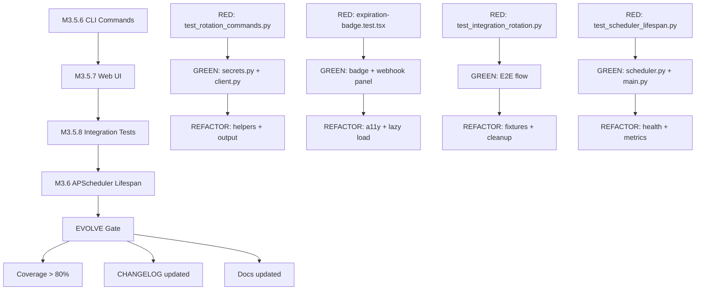

# HELL TDD Plan — M3.5.6 → M3.6

## "Alta Coesão. Baixo Acoplamento. Sem piedade."

---

## Status Atual

| Milestone                      | Status     | Arquivos                                                                                                                                                              |
| ------------------------------ | ---------- | --------------------------------------------------------------------------------------------------------------------------------------------------------------------- |
| M3.5.1 — Model + Schema       | ✅ DONE    | [`secret_expiration.py`](apps/api/app/models/secret_expiration.py), [`schemas/secret_expiration.py`](apps/api/app/schemas/secret_expiration.py)                       |
| M3.5.2 — Rotation Service     | ✅ DONE    | [`rotation_service.py`](apps/api/app/services/rotation_service.py)                                                                                                    |
| M3.5.3 — Rotation Router      | ✅ DONE    | [`routers/rotation.py`](apps/api/app/routers/rotation.py), [`test_rotation_routes.py`](apps/api/tests/test_rotation_routes.py)                                        |
| M3.5.4 — Webhook Service      | ✅ DONE    | [`webhook_service.py`](apps/api/app/services/webhook_service.py), [`test_webhook_service.py`](apps/api/tests/test_webhook_service.py)                                 |
| M3.5.5 — Background Job       | ✅ DONE    | [`expiration_check.py`](apps/api/app/jobs/expiration_check.py), [`test_expiration_check.py`](apps/api/tests/test_expiration_check.py)                                 |
| M3.5.6 — CLI Commands         | 🔴 NEXT    | [`commands/secrets.py`](apps/cli/src/criptenv/commands/secrets.py) — MODIFY                                                                                           |
| M3.5.7 — Web UI               | ⏳ PENDING | [`secret-row.tsx`](apps/web/src/components/shared/secret-row.tsx) — MODIFY, [`settings/page.tsx`](apps/web/src/app/(dashboard)/projects/[id]/settings/page.tsx) — MODIFY |
| M3.5.8 — Integration Tests    | ⏳ PENDING | `apps/api/tests/test_integration_rotation.py` — CREATE                                                                                                                |
| M3.6 — APScheduler Lifespan   | ⏳ PENDING | [`main.py`](apps/api/main.py) — MODIFY                                                                                                                                |

---

## HELL Logic Gate (Pré-Implementação)

### Information Expert

| Quem detém a informação?           | Responsável                                        |
| ---------------------------------- | -------------------------------------------------- |
| Expiração/rotação de secrets       | `RotationService` (existente) → CLI consome via API |
| Webhook delivery state             | `WebhookService` (existente)                       |
| Expiration check scheduling        | `ExpirationChecker` (existente) → APScheduler      |
| Configuração de webhook por projeto | `ProjectSettings` (novo campo) ou `Project` model  |
| UI state de badges                 | `SecretRow` component (existente)                  |

### Pure Fabrication

| Abstração              | Justificativa                                              |
| ---------------------- | ---------------------------------------------------------- |
| `rotation` CLI group   | Thin controller delegando para API client                  |
| `ExpirationBadge`      | Componente visual reutilizável para status de expiração    |
| `WebhookConfigPanel`   | Pure fabrication para configuração de webhook no settings  |
| `SchedulerManager`     | Encapsula lifecycle do APScheduler no FastAPI lifespan     |

### Protected Variations

| O que pode mudar?                              | Proteção                                              |
| ---------------------------------------------- | ----------------------------------------------------- |
| Canal de notificação (webhook → email → slack) | `NotificationChannel` protocol (existente)            |
| Scheduler backend                              | `SchedulerManager` abstraction                        |
| API response format para expiração             | Schema `ExpirationResponse` (existente)               |
| Webhook URL storage                            | Campo no `Project` model ou tabela separada           |

### Indirection

| Comunicação                      | Mediador                                    |
| ------------------------------- | ------------------------------------------- |
| CLI → Rotation API              | `CriptEnvClient` methods (novo)             |
| FastAPI lifespan → Scheduler    | `SchedulerManager`                          |
| ExpirationChecker → Webhook URL | `Project` model field                       |
| UI → Expiration API             | `rotationApi` client module (novo)          |

### Polymorphism

| Condicional complexa                    | Solução                                    |
| --------------------------------------- | ------------------------------------------ |
| Notification channel (webhook vs email) | Strategy pattern via `NotificationChannel` |
| Badge variant (expiring/expired/ok)     | Conditional rendering com variant props    |
| Scheduler config (dev vs prod)          | Environment-based config                   |

---

## M3.5.6 — CLI Commands

### SPEC

Adicionar comandos CLI para rotação e gerenciamento de expiração de secrets. Os comandos consomem a API existente via `CriptEnvClient`.

**Comandos:**

| Comando                                 | Descrição                          |
| --------------------------------------- | ---------------------------------- |
| `criptenv rotate KEY --env <env>`       | Rotacionar um secret               |
| `criptenv secrets expire KEY --days 90` | Definir expiração em secret        |
| `criptenv secrets alert KEY --days 30`  | Configurar timing de alerta        |
| `criptenv rotation list --env <env>`    | Listar secrets pendentes de rotação |

### TDD RED — Testes

```python
# apps/cli/tests/test_rotation_commands.py

"""Tests for rotation CLI commands M3.5.6.

TDD RED Phase: Tests that describe expected behavior.
"""

import pytest
from click.testing import CliRunner
from unittest.mock import patch, AsyncMock, MagicMock

from criptenv.cli import main


class TestRotateCommand:
    """TDD RED: Tests for 'criptenv rotate' command."""

    def test_rotate_command_exists(self):
        """rotate command should be registered in CLI."""
        result = CliRunner().invoke(main, ["rotate", "--help"])
        assert result.exit_code == 0
        assert "Rotate" in result.output or "rotate" in result.output

    def test_rotate_requires_key_argument(self):
        """rotate command should require KEY argument."""
        result = CliRunner().invoke(main, ["rotate"])
        assert result.exit_code != 0

    def test_rotate_with_env_option(self, runner, mock_config_dir):
        """rotate command should accept --env option."""
        result = runner.invoke(main, ["rotate", "API_KEY", "--env", "staging", "--help"])
        assert result.exit_code == 0

    def test_rotate_calls_api(self, runner, mock_config_dir, mock_api_client):
        """rotate command should call API to rotate secret."""
        mock_api_client.rotate_secret = AsyncMock(return_value={
            "rotation_id": "rot-123",
            "secret_key": "API_KEY",
            "rotated_at": "2026-05-01T10:00:00Z",
            "new_version": 3,
            "previous_version": 2
        })
        # ... invoke and assert API was called

    def test_rotate_shows_success_message(self, runner, mock_config_dir, mock_api_client):
        """rotate command should show success with new version."""
        # ... invoke and assert output contains "Rotated" and version info

    def test_rotate_with_value_option(self, runner, mock_config_dir, mock_api_client):
        """rotate command should accept --value for manual new value."""
        # ... invoke with --value and assert

    def test_rotate_secret_not_found(self, runner, mock_config_dir, mock_api_client):
        """rotate command should handle 404 gracefully."""
        mock_api_client.rotate_secret = AsyncMock(side_effect=CriptEnvAPIError(404, "Not found"))
        # ... invoke and assert error message


class TestExpireCommand:
    """TDD RED: Tests for 'criptenv secrets expire' command."""

    def test_expire_command_exists(self):
        """expire subcommand should be registered under secrets."""
        result = CliRunner().invoke(main, ["secrets", "expire", "--help"])
        assert result.exit_code == 0

    def test_expire_requires_key_and_days(self):
        """expire command should require KEY argument and --days option."""
        result = CliRunner().invoke(main, ["secrets", "expire"])
        assert result.exit_code != 0

    def test_expire_sets_expiration(self, runner, mock_config_dir, mock_api_client):
        """expire command should call API to set expiration."""
        mock_api_client.set_expiration = AsyncMock(return_value={
            "id": "exp-123",
            "secret_key": "API_KEY",
            "expires_at": "2026-08-01T00:00:00Z",
            "rotation_policy": "notify",
            "notify_days_before": 7
        })
        # ... invoke and assert

    def test_expire_with_policy_option(self, runner, mock_config_dir, mock_api_client):
        """expire command should accept --policy option."""
        # ... invoke with --policy auto and assert

    def test_expire_shows_confirmation(self, runner, mock_config_dir, mock_api_client):
        """expire command should show expiration date confirmation."""
        # ... assert output contains expiration date


class TestAlertCommand:
    """TDD RED: Tests for 'criptenv secrets alert' command."""

    def test_alert_command_exists(self):
        """alert subcommand should be registered under secrets."""
        result = CliRunner().invoke(main, ["secrets", "alert", "--help"])
        assert result.exit_code == 0

    def test_alert_updates_notify_days(self, runner, mock_config_dir, mock_api_client):
        """alert command should update notify_days_before."""
        # ... invoke and assert API call with new notify_days


class TestRotationListCommand:
    """TDD RED: Tests for 'criptenv rotation list' command."""

    def test_rotation_list_command_exists(self):
        """rotation list command should be registered."""
        result = CliRunner().invoke(main, ["rotation", "list", "--help"])
        assert result.exit_code == 0

    def test_rotation_list_shows_expiring_secrets(self, runner, mock_config_dir, mock_api_client):
        """rotation list should display secrets pending rotation."""
        mock_api_client.list_expiring = AsyncMock(return_value={
            "items": [
                {"secret_key": "API_KEY", "expires_at": "2026-05-15T00:00:00Z", "days_until_expiration": 14},
                {"secret_key": "DB_PASS", "expires_at": "2026-05-05T00:00:00Z", "days_until_expiration": 4}
            ],
            "total": 2
        })
        # ... invoke and assert table output

    def test_rotation_list_empty(self, runner, mock_config_dir, mock_api_client):
        """rotation list should show message when no secrets expiring."""
        mock_api_client.list_expiring = AsyncMock(return_value={"items": [], "total": 0})
        # ... assert "No secrets" message

    def test_rotation_list_with_days_filter(self, runner, mock_config_dir, mock_api_client):
        """rotation list should accept --days filter."""
        # ... invoke with --days 7 and assert API called with days=7
```

### GREEN — Implementação

**Arquivos a modificar:**

| Arquivo                                                                        | Ação     | Descrição                                              |
| ------------------------------------------------------------------------------ | -------- | ------------------------------------------------------ |
| [`apps/cli/src/criptenv/api/client.py`](apps/cli/src/criptenv/api/client.py)   | MODIFY   | Adicionar métodos: `rotate_secret`, `set_expiration`, `update_alert`, `list_expiring` |
| [`apps/cli/src/criptenv/commands/secrets.py`](apps/cli/src/criptenv/commands/secrets.py) | MODIFY | Adicionar comandos: `rotate_command`, `expire_command`, `alert_command` |
| [`apps/cli/src/criptenv/cli.py`](apps/cli/src/criptenv/cli.py)                | MODIFY   | Registrar novos comandos e grupo `rotation`            |
| [`apps/cli/tests/test_rotation_commands.py`](apps/cli/tests/test_rotation_commands.py) | CREATE | Testes TDD RED |

**Novos métodos no `CriptEnvClient`:**

```python
# apps/cli/src/criptenv/api/client.py — novos métodos

async def rotate_secret(self, project_id: str, env_id: str, key: str, 
                         new_value: str, iv: str, auth_tag: str) -> dict:
    """POST /api/v1/projects/{pid}/environments/{eid}/secrets/{key}/rotate"""
    resp = await self._request(
        "POST",
        f"/api/v1/projects/{project_id}/environments/{env_id}/secrets/{key}/rotate",
        json={"new_value": new_value, "iv": iv, "auth_tag": auth_tag}
    )
    return resp.json()

async def set_expiration(self, project_id: str, env_id: str, key: str,
                          expires_at: str, rotation_policy: str = "notify",
                          notify_days_before: int = 7) -> dict:
    """POST /api/v1/projects/{pid}/environments/{eid}/secrets/{key}/expiration"""
    resp = await self._request(
        "POST",
        f"/api/v1/projects/{project_id}/environments/{env_id}/secrets/{key}/expiration",
        json={
            "secret_key": key,
            "expires_at": expires_at,
            "rotation_policy": rotation_policy,
            "notify_days_before": notify_days_before
        }
    )
    return resp.json()

async def list_expiring(self, project_id: str, days: int = 30) -> dict:
    """GET /api/v1/projects/{pid}/secrets/expiring?days=N"""
    resp = await self._request(
        "GET",
        f"/api/v1/projects/{project_id}/secrets/expiring?days={days}"
    )
    return resp.json()

async def get_rotation_status(self, project_id: str, env_id: str, key: str) -> dict:
    """GET /api/v1/projects/{pid}/environments/{eid}/secrets/{key}/rotation"""
    resp = await self._request(
        "GET",
        f"/api/v1/projects/{project_id}/environments/{env_id}/secrets/{key}/rotation"
    )
    return resp.json()
```

**Novos comandos em `secrets.py`:**

```python
# apps/cli/src/criptenv/commands/secrets.py — novos comandos

@click.command()
@click.argument("key")
@click.option("--env", "-e", "env_name", default=None, help="Environment name or ID")
@click.option("--project", "-p", default=None, help="Project name or ID")
@click.option("--value", "-v", default=None, help="New value (auto-generated if omitted)")
@click.option("--force", "-f", is_flag=True, help="Skip confirmation")
def rotate_command(key: str, env_name: str | None, project: str | None, 
                   value: str | None, force: bool):
    """Rotate a secret — creates new version, marks old as rotated.
    
    \b
    Examples:
        criptenv rotate API_KEY
        criptenv rotate DB_PASSWORD -e staging
        criptenv rotate API_KEY --value "new-secret-value"
    """
    # 1. Resolve project/env
    # 2. Encrypt new value (or auto-generate)
    # 3. Call API: rotate_secret()
    # 4. Show confirmation with old vs new (truncated)


@click.command("expire")
@click.argument("key")
@click.option("--days", "-d", required=True, type=int, help="Days until expiration")
@click.option("--policy", "-p", type=click.Choice(["manual", "notify", "auto"]), 
              default="notify", help="Rotation policy")
@click.option("--env", "-e", "env_name", default=None, help="Environment name or ID")
@click.option("--project", "-p", default=None, help="Project name or ID")
def expire_command(key: str, days: int, policy: str, env_name: str | None, project: str | None):
    """Set expiration on a secret.
    
    \b
    Examples:
        criptenv secrets expire API_KEY --days 90
        criptenv secrets expire DB_PASSWORD --days 30 --policy auto
    """
    # 1. Calculate expires_at from --days
    # 2. Call API: set_expiration()
    # 3. Show confirmation with date


@click.command("alert")
@click.argument("key")
@click.option("--days", "-d", required=True, type=int, help="Days before expiration to alert")
@click.option("--env", "-e", "env_name", default=None, help="Environment name or ID")
@click.option("--project", "-p", default=None, help="Project name or ID")
def alert_command(key: str, days: int, env_name: str | None, project: str | None):
    """Configure alert timing for a secret.
    
    \b
    Examples:
        criptenv secrets alert API_KEY --days 30
        criptenv secrets alert DB_PASSWORD --days 14 -e staging
    """
    # 1. Call API: set_expiration() with updated notify_days_before
    # 2. Show confirmation


# Grupo rotation
@click.group("rotation")
def rotation_group():
    """Manage secret rotation."""
    pass

@rotation_group.command("list")
@click.option("--env", "-e", "env_name", default=None, help="Environment name or ID")
@click.option("--project", "-p", default=None, help="Project name or ID")
@click.option("--days", "-d", default=30, type=int, help="Days ahead to check")
def rotation_list_command(env_name: str | None, project: str | None, days: int):
    """List secrets pending rotation.
    
    \b
    Examples:
        criptenv rotation list
        criptenv rotation list --days 7
        criptenv rotation list -e staging
    """
    # 1. Call API: list_expiring()
    # 2. Render table with key, expires_at, days_until, policy
```

### REFACTOR

- Extrair helper `_resolve_project_env()` para reutilização entre comandos
- Padronizar output com `click.echo()` formatado (tabela para listas, ✓ para sucesso)
- Adicionar `--output json` flag global para integração com scripts
- Verificar consistência com padrão dos comandos `ci.py` existentes

---

## M3.5.7 — Web UI

### SPEC

Adicionar expiration badges na tabela de secrets e configuração de webhook no settings do projeto.

**Features:**

| Feature                    | Descrição                                              |
| -------------------------- | ------------------------------------------------------ |
| Expiration Badge           | Badge colorido em cada secret row mostrando status     |
| Expiration Tooltip         | Tooltip com data exata e dias restantes                |
| Webhook Config Panel       | Formulário para configurar webhook URL no projeto      |
| Rotation History Modal     | Modal com timeline de rotações (stretch goal)          |

### TDD RED — Testes

```tsx
// apps/web/src/components/shared/__tests__/expiration-badge.test.tsx

import { render, screen } from '@testing-library/react';
import { ExpirationBadge } from '../expiration-badge';

describe('ExpirationBadge', () => {
  it('renders nothing when no expiration data', () => {
    const { container } = render(<ExpirationBadge />);
    expect(container.firstChild).toBeNull();
  });

  it('renders green badge for secrets with >30 days', () => {
    render(<ExpirationBadge daysUntilExpiration={45} />);
    const badge = screen.getByText(/45 dias/i);
    expect(badge).toBeInTheDocument();
    expect(badge.closest('[data-variant]')).toHaveAttribute('data-variant', 'success');
  });

  it('renders yellow badge for secrets with 7-30 days', () => {
    render(<ExpirationBadge daysUntilExpiration={14} />);
    const badge = screen.getByText(/14 dias/i);
    expect(badge.closest('[data-variant]')).toHaveAttribute('data-variant', 'warning');
  });

  it('renders red badge for secrets with <7 days', () => {
    render(<ExpirationBadge daysUntilExpiration={3} />);
    const badge = screen.getByText(/3 dias/i);
    expect(badge.closest('[data-variant]')).toHaveAttribute('data-variant', 'danger');
  });

  it('renders expired badge for secrets past expiration', () => {
    render(<ExpirationBadge daysUntilExpiration={-5} isExpired={true} />);
    expect(screen.getByText(/expirado/i)).toBeInTheDocument();
  });
});

// apps/web/src/components/shared/__tests__/webhook-config-panel.test.tsx

import { render, screen, fireEvent, waitFor } from '@testing-library/react';
import { WebhookConfigPanel } from '../webhook-config-panel';

describe('WebhookConfigPanel', () => {
  it('renders webhook URL input', () => {
    render(<WebhookConfigPanel projectId="proj-123" />);
    expect(screen.getByLabelText(/webhook url/i)).toBeInTheDocument();
  });

  it('validates URL format', async () => {
    render(<WebhookConfigPanel projectId="proj-123" />);
    const input = screen.getByLabelText(/webhook url/i);
    fireEvent.change(input, { target: { value: 'not-a-url' } });
    fireEvent.click(screen.getByText(/salvar/i));
    expect(screen.getByText(/url inválida/i)).toBeInTheDocument();
  });

  it('saves valid webhook URL', async () => {
    const onSave = jest.fn().mockResolvedValue({});
    render(<WebhookConfigPanel projectId="proj-123" onSave={onSave} />);
    fireEvent.change(screen.getByLabelText(/webhook url/i), { 
      target: { value: 'https://example.com/webhook' } 
    });
    fireEvent.click(screen.getByText(/salvar/i));
    await waitFor(() => expect(onSave).toHaveBeenCalledWith('https://example.com/webhook'));
  });

  it('shows test webhook button', () => {
    render(<WebhookConfigPanel projectId="proj-123" currentUrl="https://example.com/hook" />);
    expect(screen.getByText(/testar/i)).toBeInTheDocument();
  });
});
```

### GREEN — Implementação

**Arquivos a modificar/criar:**

| Arquivo                                                                              | Ação     | Descrição                                    |
| ------------------------------------------------------------------------------------ | -------- | -------------------------------------------- |
| [`apps/web/src/components/shared/expiration-badge.tsx`](apps/web/src/components/shared/expiration-badge.tsx) | CREATE | Componente `ExpirationBadge`                 |
| [`apps/web/src/components/shared/secret-row.tsx`](apps/web/src/components/shared/secret-row.tsx) | MODIFY | Adicionar `ExpirationBadge` ao layout        |
| [`apps/web/src/components/shared/webhook-config-panel.tsx`](apps/web/src/components/shared/webhook-config-panel.tsx) | CREATE | Painel de configuração de webhook            |
| [`apps/web/src/app/(dashboard)/projects/[id]/settings/page.tsx`](apps/web/src/app/(dashboard)/projects/[id]/settings/page.tsx) | MODIFY | Incluir `WebhookConfigPanel`                 |
| [`apps/web/src/lib/api/rotation.ts`](apps/web/src/lib/api/rotation.ts)              | CREATE   | API client para endpoints de rotação         |
| [`apps/web/src/types/index.ts`](apps/web/src/types/index.ts)                        | MODIFY   | Adicionar tipos `ExpirationInfo`, `RotationStatus` |

**Novo componente `ExpirationBadge`:**

```tsx
// apps/web/src/components/shared/expiration-badge.tsx

"use client"

import { Badge } from "@/components/ui/badge"
import { Clock, AlertTriangle, XCircle } from "lucide-react"

interface ExpirationBadgeProps {
  daysUntilExpiration?: number | null
  isExpired?: boolean
  expiresAt?: string
}

export function ExpirationBadge({ daysUntilExpiration, isExpired, expiresAt }: ExpirationBadgeProps) {
  if (daysUntilExpiration == null && !isExpired) return null

  if (isExpired || (daysUntilExpiration != null && daysUntilExpiration < 0)) {
    return (
      <Badge variant="destructive" className="gap-1 text-[10px]">
        <XCircle className="h-3 w-3" />
        Expirado
      </Badge>
    )
  }

  if (daysUntilExpiration <= 7) {
    return (
      <Badge className="gap-1 bg-amber-500 text-white text-[10px]" title={expiresAt}>
        <AlertTriangle className="h-3 w-3" />
        {daysUntilExpiration} dias
      </Badge>
    )
  }

  if (daysUntilExpiration <= 30) {
    return (
      <Badge className="gap-1 bg-yellow-400 text-yellow-900 text-[10px]" title={expiresAt}>
        <Clock className="h-3 w-3" />
        {daysUntilExpiration} dias
      </Badge>
    )
  }

  return (
    <Badge variant="outline" className="gap-1 text-[10px] text-green-600" title={expiresAt}>
      <Clock className="h-3 w-3" />
      {daysUntilExpiration} dias
    </Badge>
  )
}
```

**Novo API client `rotation.ts`:**

```typescript
// apps/web/src/lib/api/rotation.ts

import { request } from './client';

export interface ExpirationInfo {
  id: string;
  secret_key: string;
  expires_at: string;
  rotation_policy: string;
  notify_days_before: number;
  is_expired: boolean;
  days_until_expiration: number | null;
}

export interface RotationStatus {
  current_version: number;
  rotation_policy: string;
  expires_at: string | null;
  last_rotated_at: string | null;
}

export const rotationApi = {
  setExpiration(projectId: string, envId: string, key: string, body: {
    expires_at: string;
    rotation_policy?: string;
    notify_days_before?: number;
  }): Promise<ExpirationInfo> {
    return request('POST', `/api/v1/projects/${projectId}/environments/${envId}/secrets/${key}/expiration`, body);
  },

  getStatus(projectId: string, envId: string, key: string): Promise<RotationStatus> {
    return request('GET', `/api/v1/projects/${projectId}/environments/${envId}/secrets/${key}/rotation`);
  },

  listExpiring(projectId: string, days: number = 30): Promise<{ items: ExpirationInfo[]; total: number }> {
    return request('GET', `/api/v1/projects/${projectId}/secrets/expiring?days=${days}`);
  },

  rotate(projectId: string, envId: string, key: string, body: {
    new_value: string;
    iv: string;
    auth_tag: string;
  }) {
    return request('POST', `/api/v1/projects/${projectId}/environments/${envId}/secrets/${key}/rotate`, body);
  },
};
```

### REFACTOR

- Extrair variantes de badge para `useExpirationVariant` hook
- Garantir acessibilidade: `aria-label` em badges, `role="status"` para screen readers
- Lazy load do `WebhookConfigPanel` com `React.lazy()` para não impactar bundle inicial

---

## M3.5.8 — Integration Tests

### SPEC

Testes de integração E2E cobrindo o fluxo completo: criar secret → definir expiração → verificar status → rotacionar → verificar histórico.

### TDD RED — Testes

```python
# apps/api/tests/test_integration_rotation.py

"""Integration tests for M3.5 — Secret Rotation E2E Flow.

Tests the complete lifecycle:
1. Create secret in vault
2. Set expiration
3. Check rotation status
4. Rotate secret
5. Verify rotation history
6. Verify webhook notification (mocked)
"""

import pytest
from datetime import datetime, timezone, timedelta


class TestRotationE2EFlow:
    """E2E integration test for complete rotation lifecycle."""

    @pytest.mark.asyncio
    async def test_full_rotation_lifecycle(self, auth_headers, project_id, env_id, client):
        """Test: create → expire → status → rotate → history."""
        
        # Step 1: Create a secret via vault push
        push_response = await client.post(
            f"/api/v1/projects/{project_id}/environments/{env_id}/vault/push",
            json={"blobs": [{
                "key_id": "E2E_SECRET",
                "iv": "base64iv",
                "ciphertext": "base64ct",
                "auth_tag": "base64tag",
                "version": 1,
                "checksum": "sha256:abc"
            }]},
            headers=auth_headers
        )
        assert push_response.status_code == 200

        # Step 2: Set expiration (90 days from now)
        expires_at = (datetime.now(timezone.utc) + timedelta(days=90)).isoformat()
        expire_response = await client.post(
            f"/api/v1/projects/{project_id}/environments/{env_id}/secrets/E2E_SECRET/expiration",
            json={
                "secret_key": "E2E_SECRET",
                "expires_at": expires_at,
                "rotation_policy": "notify",
                "notify_days_before": 14
            },
            headers=auth_headers
        )
        assert expire_response.status_code == 201
        expiration_data = expire_response.json()
        assert expiration_data["rotation_policy"] == "notify"

        # Step 3: Check rotation status
        status_response = await client.get(
            f"/api/v1/projects/{project_id}/environments/{env_id}/secrets/E2E_SECRET/rotation",
            headers=auth_headers
        )
        assert status_response.status_code == 200
        status_data = status_response.json()
        assert status_data["rotation_policy"] == "notify"

        # Step 4: Rotate the secret
        rotate_response = await client.post(
            f"/api/v1/projects/{project_id}/environments/{env_id}/secrets/E2E_SECRET/rotate",
            json={
                "new_value": "new_encrypted_value",
                "iv": "new_iv",
                "auth_tag": "new_tag"
            },
            headers=auth_headers
        )
        assert rotate_response.status_code == 200
        rotation_data = rotate_response.json()
        assert rotation_data["new_version"] > 1

        # Step 5: Verify rotation history
        history_response = await client.get(
            f"/api/v1/projects/{project_id}/environments/{env_id}/secrets/E2E_SECRET/rotation/history",
            headers=auth_headers
        )
        assert history_response.status_code == 200
        history = history_response.json()
        assert len(history["items"]) >= 1

        # Step 6: Verify expiring list includes our secret
        expiring_response = await client.get(
            f"/api/v1/projects/{project_id}/secrets/expiring?days=100",
            headers=auth_headers
        )
        assert expiring_response.status_code == 200
        expiring = expiring_response.json()
        keys = [item["secret_key"] for item in expiring["items"]]
        assert "E2E_SECRET" in keys

    @pytest.mark.asyncio
    async def test_rotation_audit_trail(self, auth_headers, project_id, env_id, client):
        """Rotation should create audit log entries."""
        # ... rotate a secret and verify audit contains 'secret.rotated'

    @pytest.mark.asyncio
    async def test_expiration_update_idempotent(self, auth_headers, project_id, env_id, client):
        """Setting expiration twice should update, not duplicate."""
        # ... set expiration twice, verify only one record exists

    @pytest.mark.asyncio
    async def test_webhook_notification_on_expiring(self, auth_headers, project_id, env_id, client):
        """ExpirationChecker should trigger webhook for expiring secrets."""
        # ... mock webhook, set expiration in the past, run checker
```

### REFACTOR

- Extrair fixtures compartilhadas para `conftest.py`
- Adicionar cleanup de dados de teste no teardown
- Verificar que testes são independentes (não dependem de ordem)

---

## M3.6 — APScheduler Lifespan

### SPEC

Integrar APScheduler no lifespan do FastAPI para executar `ExpirationChecker` periodicamente. O scheduler deve iniciar com a aplicação e parar gracefully no shutdown.

### TDD RED — Testes

```python
# apps/api/tests/test_scheduler_lifespan.py

"""Tests for APScheduler integration in FastAPI lifespan M3.6.

TDD RED Phase: Tests for scheduler lifecycle management.
"""

import pytest
from unittest.mock import patch, AsyncMock, MagicMock, call


class TestSchedulerLifespan:
    """TDD RED: Tests for scheduler integration in FastAPI lifespan."""

    def test_lifespan_starts_scheduler(self):
        """FastAPI lifespan should start APScheduler on startup."""
        from app.main import app, lifespan
        # Verify scheduler is configured in lifespan

    def test_lifespan_stops_scheduler_on_shutdown(self):
        """FastAPI lifespan should shutdown scheduler gracefully."""
        # Verify scheduler.shutdown() is called

    def test_scheduler_job_runs_expiration_check(self):
        """Scheduler job should invoke ExpirationChecker.check_expirations."""
        from app.jobs.expiration_check import create_scheduler_job, ExpirationChecker
        # Verify job function calls checker

    def test_scheduler_interval_configurable(self):
        """Scheduler interval should be configurable via settings."""
        from app.config import settings
        # Verify SCHEDULER_INTERVAL_HOURS setting exists

    def test_scheduler_disabled_in_test_mode(self):
        """Scheduler should be disabled during testing."""
        # Verify scheduler doesn't start when TESTING=true

    @pytest.mark.asyncio
    async def test_scheduler_handles_job_failure_gracefully(self):
        """Scheduler should log errors but not crash on job failure."""
        # Mock checker to raise exception, verify it's caught


class TestSchedulerManager:
    """TDD RED: Tests for SchedulerManager abstraction."""

    def test_manager_creates_scheduler(self):
        """SchedulerManager should create AsyncIOScheduler."""
        from app.jobs.scheduler import SchedulerManager
        manager = SchedulerManager()
        assert manager.scheduler is not None

    def test_manager_adds_expiration_job(self):
        """SchedulerManager should add expiration check job."""
        from app.jobs.scheduler import SchedulerManager
        manager = SchedulerManager()
        mock_checker = MagicMock()
        manager.add_expiration_job(mock_checker, interval_hours=1)
        # Verify job was added

    def test_manager_starts(self):
        """SchedulerManager.start() should start the scheduler."""
        from app.jobs.scheduler import SchedulerManager
        manager = SchedulerManager()
        manager.start()
        # Verify scheduler is running

    def test_manager_stops(self):
        """SchedulerManager.stop() should shutdown gracefully."""
        from app.jobs.scheduler import SchedulerManager
        manager = SchedulerManager()
        manager.start()
        manager.stop()
        # Verify scheduler is stopped
```

### GREEN — Implementação

**Arquivos a modificar/criar:**

| Arquivo                                                                              | Ação     | Descrição                                    |
| ------------------------------------------------------------------------------------ | -------- | -------------------------------------------- |
| [`apps/api/app/jobs/scheduler.py`](apps/api/app/jobs/scheduler.py)                  | CREATE   | `SchedulerManager` abstraction               |
| [`apps/api/app/config.py`](apps/api/app/config.py)                                  | MODIFY   | Adicionar `SCHEDULER_INTERVAL_HOURS`, `SCHEDULER_ENABLED` |
| [`apps/api/main.py`](apps/api/main.py)                                              | MODIFY   | Integrar `SchedulerManager` no lifespan      |
| [`apps/api/requirements.txt`](apps/api/requirements.txt)                            | MODIFY   | Adicionar `apscheduler>=3.10`                |
| [`apps/api/tests/test_scheduler_lifespan.py`](apps/api/tests/test_scheduler_lifespan.py) | CREATE | Testes TDD RED |

**Novo `SchedulerManager`:**

```python
# apps/api/app/jobs/scheduler.py

"""Scheduler Manager for APScheduler integration.

GRASP Patterns:
- Pure Fabrication: Encapsulates scheduler lifecycle
- Protected Variations: Abstracts scheduler backend
- Low Coupling: Decoupled from specific job implementations
"""

import logging
from typing import Optional
from apscheduler.schedulers.asyncio import AsyncIOScheduler
from apscheduler.triggers.interval import IntervalTrigger

logger = logging.getLogger(__name__)


class SchedulerManager:
    """Manages APScheduler lifecycle for background jobs.
    
    Usage:
        manager = SchedulerManager()
        manager.add_expiration_job(checker, interval_hours=1)
        manager.start()
        # ... later ...
        manager.stop()
    """
    
    def __init__(self):
        self.scheduler = AsyncIOScheduler()
        self._started = False
    
    def add_expiration_job(self, checker, interval_hours: int = 1):
        """Add expiration check job to scheduler.
        
        Args:
            checker: ExpirationChecker instance
            interval_hours: How often to run the check
        """
        from app.jobs.expiration_check import create_scheduler_job
        
        job_func = create_scheduler_job(checker)
        self.scheduler.add_job(
            job_func,
            trigger=IntervalTrigger(hours=interval_hours),
            id="expiration_check",
            name="Secret Expiration Check",
            replace_existing=True,
            misfire_grace_time=300  # 5 minutes grace
        )
        logger.info(f"Added expiration check job (interval: {interval_hours}h)")
    
    def start(self):
        """Start the scheduler."""
        if not self._started:
            self.scheduler.start()
            self._started = True
            logger.info("Scheduler started")
    
    def stop(self):
        """Stop the scheduler gracefully."""
        if self._started:
            self.scheduler.shutdown(wait=True)
            self._started = False
            logger.info("Scheduler stopped")
    
    @property
    def is_running(self) -> bool:
        return self._started
```

**Modificação no `main.py`:**

```python
# apps/api/main.py — lifespan modificado

@asynccontextmanager
async def lifespan(app: FastAPI):
    logger.info("Starting CriptEnv API...")
    
    # Start scheduler if enabled
    scheduler_manager = None
    if settings.SCHEDULER_ENABLED:
        from app.jobs.scheduler import SchedulerManager
        from app.jobs.expiration_check import ExpirationChecker
        from app.database import get_db_session
        
        scheduler_manager = SchedulerManager()
        db_session = get_db_session()
        checker = ExpirationChecker(db_session)
        scheduler_manager.add_expiration_job(
            checker, 
            interval_hours=settings.SCHEDULER_INTERVAL_HOURS
        )
        scheduler_manager.start()
        logger.info(f"Scheduler running (interval: {settings.SCHEDULER_INTERVAL_HOURS}h)")
    
    yield
    
    # Graceful shutdown
    if scheduler_manager:
        scheduler_manager.stop()
    
    logger.info("Shutting down CriptEnv API...")
    await close_db()
```

**Configuração:**

```python
# apps/api/app/config.py — novos campos

class Settings(BaseSettings):
    # ... existing fields ...
    
    # Scheduler settings
    SCHEDULER_ENABLED: bool = True
    SCHEDULER_INTERVAL_HOURS: int = 1
```

### REFACTOR

- Adicionar health check que reporta status do scheduler
- Configurar `misfire_grace_time` baseado no intervalo
- Adicionar métricas de execução (success/failure count)
- Garantir que scheduler não inicia em modo de teste (`TESTING=true`)

---

## Fluxo HELL Completo



---

## Arquivos Resumo

| Arquivo                                                                              | Ação     | Milestone |
| ------------------------------------------------------------------------------------ | -------- | --------- |
| [`apps/cli/tests/test_rotation_commands.py`](apps/cli/tests/test_rotation_commands.py) | CREATE | M3.5.6    |
| [`apps/cli/src/criptenv/api/client.py`](apps/cli/src/criptenv/api/client.py)         | MODIFY | M3.5.6    |
| [`apps/cli/src/criptenv/commands/secrets.py`](apps/cli/src/criptenv/commands/secrets.py) | MODIFY | M3.5.6 |
| [`apps/cli/src/criptenv/cli.py`](apps/cli/src/criptenv/cli.py)                       | MODIFY | M3.5.6    |
| [`apps/web/src/components/shared/expiration-badge.tsx`](apps/web/src/components/shared/expiration-badge.tsx) | CREATE | M3.5.7 |
| [`apps/web/src/components/shared/secret-row.tsx`](apps/web/src/components/shared/secret-row.tsx) | MODIFY | M3.5.7 |
| [`apps/web/src/components/shared/webhook-config-panel.tsx`](apps/web/src/components/shared/webhook-config-panel.tsx) | CREATE | M3.5.7 |
| [`apps/web/src/app/(dashboard)/projects/[id]/settings/page.tsx`](apps/web/src/app/(dashboard)/projects/[id]/settings/page.tsx) | MODIFY | M3.5.7 |
| [`apps/web/src/lib/api/rotation.ts`](apps/web/src/lib/api/rotation.ts)               | CREATE | M3.5.7    |
| [`apps/web/src/types/index.ts`](apps/web/src/types/index.ts)                         | MODIFY | M3.5.7    |
| [`apps/api/tests/test_integration_rotation.py`](apps/api/tests/test_integration_rotation.py) | CREATE | M3.5.8 |
| [`apps/api/app/jobs/scheduler.py`](apps/api/app/jobs/scheduler.py)                   | CREATE | M3.6      |
| [`apps/api/app/config.py`](apps/api/app/config.py)                                   | MODIFY | M3.6      |
| [`apps/api/main.py`](apps/api/main.py)                                               | MODIFY | M3.6      |
| [`apps/api/requirements.txt`](apps/api/requirements.txt)                             | MODIFY | M3.6      |
| [`apps/api/tests/test_scheduler_lifespan.py`](apps/api/tests/test_scheduler_lifespan.py) | CREATE | M3.6   |
