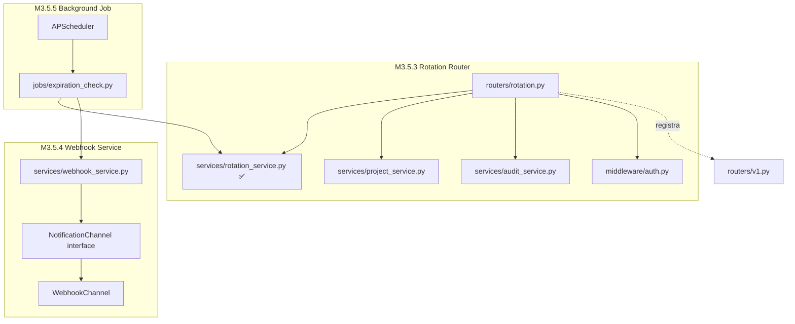

# HELL TDD Plan — M3.5 Continuation (M3.5.3 → M3.5.5)

## "Alta Coesão. Baixo Acoplamento. Sem piedade."

---

## Status Atual

| Milestone                 | Status     | Arquivos                                                                                                                                        |
| ------------------------- | ---------- | ----------------------------------------------------------------------------------------------------------------------------------------------- |
| M3.5.1 — Model + Schema   | ✅ DONE    | [`secret_expiration.py`](apps/api/app/models/secret_expiration.py), [`schemas/secret_expiration.py`](apps/api/app/schemas/secret_expiration.py) |
| M3.5.2 — Rotation Service | ✅ DONE    | [`rotation_service.py`](apps/api/app/services/rotation_service.py)                                                                              |
| M3.5.3 — Rotation Router  | 🔴 NEXT    | [`routers/rotation.py`](apps/api/app/routers/rotation.py)                                                                                       |
| M3.5.4 — Webhook Service  | ⏳ PENDING | [`services/webhook_service.py`](apps/api/app/services/webhook_service.py)                                                                       |
| M3.5.5 — Background Job   | ⏳ PENDING | [`jobs/expiration_check.py`](apps/api/app/jobs/expiration_check.py)                                                                             |

---

## HELL Logic Gate (Pré-Implementação)

### Information Expert

| Quem detém a informação?     | Responsável                                      |
| ---------------------------- | ------------------------------------------------ |
| Expiração/rotação de secrets | `RotationService` (existente) → `RotationRouter` |
| Webhook delivery state       | `WebhookService` (novo)                          |
| Expiration check scheduling  | `ExpirationChecker` (novo)                       |
| Audit de todas as operações  | `AuditService` (existente)                       |

### Pure Fabrication

| Abstração           | Justificativa                                         |
| ------------------- | ----------------------------------------------------- |
| `RotationRouter`    | Thin controller delegando para `RotationService`      |
| `WebhookService`    | Media notificações HTTP com retry logic               |
| `ExpirationChecker` | Job periódico que orquestra verificação + notificação |

### Protected Variations

| O que pode mudar?                              | Proteção                                            |
| ---------------------------------------------- | --------------------------------------------------- |
| Canal de notificação (webhook → email → slack) | `NotificationChannel` interface no `WebhookService` |
| Retry strategy                                 | Configurável no `WebhookService`                    |
| Scheduler backend                              | APScheduler com lifespan no FastAPI                 |

### Indirection

| Comunicação                  | Mediador                                |
| ---------------------------- | --------------------------------------- |
| API request → Rotation logic | `RotationRouter` → `RotationService`    |
| Expiration → Notification    | `ExpirationChecker` → `WebhookService`  |
| Background job → Database    | `ExpirationChecker` → `RotationService` |

### Polymorphism

| Condicional complexa                    | Solução                                    |
| --------------------------------------- | ------------------------------------------ |
| Notification channel (webhook vs email) | Strategy pattern via `NotificationChannel` |
| Retry backoff                           | Configurable strategy                      |

---

## M3.5.3 — Rotation Router

### SPEC

Endpoints para rotacionar secrets, configurar expiração, listar pendências e consultar status de rotação.

**Endpoints:**

| Method | Path                                                                       | Description              |
| ------ | -------------------------------------------------------------------------- | ------------------------ |
| `POST` | `/api/v1/projects/{pid}/environments/{eid}/secrets/{key}/rotate`           | Rotacionar secret        |
| `POST` | `/api/v1/projects/{pid}/environments/{eid}/secrets/{key}/expiration`       | Configurar expiração     |
| `GET`  | `/api/v1/projects/{pid}/environments/{eid}/secrets/{key}/rotation`         | Status de rotação        |
| `GET`  | `/api/v1/projects/{pid}/secrets/expiring`                                  | Listar secrets expirando |
| `GET`  | `/api/v1/projects/{pid}/environments/{eid}/secrets/{key}/rotation/history` | Histórico de rotações    |

### TDD RED — Testes

```python
# apps/api/tests/test_rotation_routes.py

class TestRotationRoutes:
    """TDD RED: Testes para endpoints de rotação."""

    # --- POST /rotate ---
    async def test_rotate_secret_returns_200(self, auth_headers, project_id, env_id):
        """Rotação de secret deve retornar 200 com rotation_id e new_version."""
        response = await client.post(
            f"/api/v1/projects/{project_id}/environments/{env_id}/secrets/DATABASE_URL/rotate",
            json={"new_value": "encrypted", "iv": "base64iv", "auth_tag": "base64tag"},
            headers=auth_headers
        )
        assert response.status_code == 200
        data = response.json()
        assert "rotation_id" in data
        assert "new_version" in data
        assert "rotated_at" in data

    async def test_rotate_secret_not_found_returns_404(self, auth_headers, project_id, env_id):
        """Rotacionar secret inexistente deve retornar 404."""
        response = await client.post(
            f"/api/v1/projects/{project_id}/environments/{env_id}/secrets/UNKNOWN_KEY/rotate",
            json={"new_value": "x", "iv": "y", "auth_tag": "z"},
            headers=auth_headers
        )
        assert response.status_code == 404

    async def test_rotate_requires_auth(self, project_id, env_id):
        """Rotação sem auth deve retornar 401."""
        response = await client.post(
            f"/api/v1/projects/{project_id}/environments/{env_id}/secrets/KEY/rotate",
            json={"new_value": "x", "iv": "y", "auth_tag": "z"}
        )
        assert response.status_code == 401

    async def test_rotate_requires_write_scope(self, read_only_headers, project_id, env_id):
        """Rotação com scope read:secrets deve retornar 403."""
        response = await client.post(
            f"/api/v1/projects/{project_id}/environments/{env_id}/secrets/KEY/rotate",
            json={"new_value": "x", "iv": "y", "auth_tag": "z"},
            headers=read_only_headers
        )
        assert response.status_code == 403

    # --- POST /expiration ---
    async def test_set_expiration_returns_201(self, auth_headers, project_id, env_id):
        """Configurar expiração deve retornar 201."""
        response = await client.post(
            f"/api/v1/projects/{project_id}/environments/{env_id}/secrets/DATABASE_URL/expiration",
            json={
                "secret_key": "DATABASE_URL",
                "expires_at": "2026-12-31T00:00:00Z",
                "rotation_policy": "notify",
                "notify_days_before": 14
            },
            headers=auth_headers
        )
        assert response.status_code == 201
        data = response.json()
        assert data["rotation_policy"] == "notify"
        assert data["notify_days_before"] == 14

    async def test_set_expiration_invalid_policy_returns_422(self, auth_headers, project_id, env_id):
        """Policy inválido deve retornar 422."""
        response = await client.post(
            f"/api/v1/projects/{project_id}/environments/{env_id}/secrets/KEY/expiration",
            json={
                "secret_key": "KEY",
                "expires_at": "2026-12-31T00:00:00Z",
                "rotation_policy": "invalid_policy"
            },
            headers=auth_headers
        )
        assert response.status_code == 422

    # --- GET /rotation ---
    async def test_get_rotation_status_returns_200(self, auth_headers, project_id, env_id):
        """Consultar status de rotação deve retornar 200."""
        response = await client.get(
            f"/api/v1/projects/{project_id}/environments/{env_id}/secrets/DATABASE_URL/rotation",
            headers=auth_headers
        )
        assert response.status_code == 200
        data = response.json()
        assert "current_version" in data
        assert "rotation_policy" in data

    async def test_get_rotation_status_not_found_returns_404(self, auth_headers, project_id, env_id):
        """Secret inexistente deve retornar 404."""
        response = await client.get(
            f"/api/v1/projects/{project_id}/environments/{env_id}/secrets/UNKNOWN/rotation",
            headers=auth_headers
        )
        assert response.status_code == 404

    # --- GET /expiring ---
    async def test_list_expiring_returns_200(self, auth_headers, project_id):
        """Listar secrets expirando deve retornar 200 com lista."""
        response = await client.get(
            f"/api/v1/projects/{project_id}/secrets/expiring?days=30",
            headers=auth_headers
        )
        assert response.status_code == 200
        data = response.json()
        assert "items" in data
        assert isinstance(data["items"], list)

    # --- GET /rotation/history ---
    async def test_rotation_history_returns_200(self, auth_headers, project_id, env_id):
        """Histórico de rotações deve retornar 200."""
        response = await client.get(
            f"/api/v1/projects/{project_id}/environments/{env_id}/secrets/DATABASE_URL/rotation/history",
            headers=auth_headers
        )
        assert response.status_code == 200
        data = response.json()
        assert "items" in data
```

### GREEN — Implementação

**Arquivo:** [`apps/api/app/routers/rotation.py`](apps/api/app/routers/rotation.py) — CREATE

```python
"""Rotation Router for M3.5 Secret Alerts

Endpoints for secret rotation, expiration management, and rotation status.

GRASP Patterns:
- Controller: Thin router delegating to RotationService
- Protected Variations: Auth via get_current_user dependency
"""

from uuid import UUID
from fastapi import APIRouter, Depends, HTTPException, status, Request, Query
from sqlalchemy.ext.asyncio import AsyncSession
from typing import Optional

from app.database import get_db
from app.services.rotation_service import RotationService
from app.services.project_service import ProjectService
from app.services.audit_service import AuditService
from app.schemas.secret_expiration import (
    ExpirationCreate, ExpirationUpdate, ExpirationResponse,
    ExpirationListResponse, RotationRequest, RotationResponse,
    RotationStatus, RotationHistoryResponse
)
from app.middleware.auth import get_current_user
from app.models.user import User


router = APIRouter(
    prefix="/api/v1/projects/{project_id}/environments/{environment_id}/secrets",
    tags=["Rotation"]
)

expiring_router = APIRouter(
    prefix="/api/v1/projects/{project_id}/secrets",
    tags=["Rotation"]
)


async def _check_access(
    user: User, project_id: UUID, environment_id: UUID,
    project_service: ProjectService, required_role: str = "developer"
):
    """Verify user has access to project/environment."""
    member = await project_service.check_user_access(user.id, project_id, required_role)
    if not member:
        raise HTTPException(
            status_code=status.HTTP_404_NOT_FOUND,
            detail="Project not found or insufficient permissions"
        )


@router.post("/{secret_key}/rotate", response_model=RotationResponse)
async def rotate_secret(
    project_id: UUID,
    environment_id: UUID,
    secret_key: str,
    request: Request,
    payload: RotationRequest,
    current_user: User = Depends(get_current_user),
    db: AsyncSession = Depends(get_db)
):
    """Rotate a secret with a new encrypted value."""
    project_service = ProjectService(db)
    rotation_service = RotationService(db)
    audit_service = AuditService(db)

    await _check_access(current_user, project_id, environment_id, project_service)

    try:
        rotation, new_version = await rotation_service.rotate_secret(
            project_id=project_id,
            environment_id=environment_id,
            secret_key=secret_key,
            payload=payload,
            user_id=current_user.id
        )
    except ValueError as e:
        raise HTTPException(status_code=status.HTTP_404_NOT_FOUND, detail=str(e))

    await audit_service.log(
        action="secret.rotated",
        resource_type="vault",
        resource_id=environment_id,
        user_id=current_user.id,
        project_id=project_id,
        metadata={"secret_key": secret_key, "new_version": new_version},
        ip_address=request.client.host if request.client else None,
        user_agent=request.headers.get("User-Agent")
    )

    return RotationResponse(
        rotation_id=rotation.id,
        secret_key=secret_key,
        rotated_at=rotation.rotated_at,
        new_version=new_version,
        previous_version=rotation.previous_version
    )


@router.post("/{secret_key}/expiration", response_model=ExpirationResponse, status_code=status.HTTP_201_CREATED)
async def set_expiration(
    project_id: UUID,
    environment_id: UUID,
    secret_key: str,
    request: Request,
    payload: ExpirationCreate,
    current_user: User = Depends(get_current_user),
    db: AsyncSession = Depends(get_db)
):
    """Configure expiration for a secret."""
    project_service = ProjectService(db)
    rotation_service = RotationService(db)
    audit_service = AuditService(db)

    await _check_access(current_user, project_id, environment_id, project_service)

    # Check if expiration already exists
    existing = await rotation_service.get_expiration(project_id, environment_id, secret_key)
    if existing:
        # Update existing
        update_payload = ExpirationUpdate(
            expires_at=payload.expires_at,
            rotation_policy=payload.rotation_policy,
            notify_days_before=payload.notify_days_before
        )
        expiration = await rotation_service.update_expiration(
            project_id, environment_id, secret_key, update_payload
        )
    else:
        # Override secret_key from path
        payload.secret_key = secret_key
        expiration = await rotation_service.create_expiration(
            project_id, environment_id, payload
        )

    await audit_service.log(
        action="expiration.set",
        resource_type="vault",
        resource_id=environment_id,
        user_id=current_user.id,
        project_id=project_id,
        metadata={"secret_key": secret_key, "expires_at": str(expiration.expires_at)},
        ip_address=request.client.host if request.client else None,
        user_agent=request.headers.get("User-Agent")
    )

    return ExpirationResponse(
        id=expiration.id,
        secret_key=expiration.secret_key,
        expires_at=expiration.expires_at,
        rotation_policy=expiration.rotation_policy,
        notify_days_before=expiration.notify_days_before,
        last_notified_at=expiration.last_notified_at,
        rotated_at=expiration.rotated_at,
        created_at=expiration.created_at,
        updated_at=expiration.updated_at,
        project_id=expiration.project_id,
        environment_id=expiration.environment_id,
        is_expired=expiration.is_expired,
        days_until_expiration=expiration.days_until_expiration
    )


@router.get("/{secret_key}/rotation", response_model=RotationStatus)
async def get_rotation_status(
    project_id: UUID,
    environment_id: UUID,
    secret_key: str,
    current_user: User = Depends(get_current_user),
    db: AsyncSession = Depends(get_db)
):
    """Get rotation status for a secret."""
    project_service = ProjectService(db)
    rotation_service = RotationService(db)

    await _check_access(current_user, project_id, environment_id, project_service)

    status_data = await rotation_service.get_rotation_status(
        project_id, environment_id, secret_key
    )

    if not status_data:
        raise HTTPException(status_code=status.HTTP_404_NOT_FOUND, detail="Secret not found")

    return status_data


@expiring_router.get("/expiring", response_model=ExpirationListResponse)
async def list_expiring_secrets(
    project_id: UUID,
    days: int = Query(default=30, ge=1, le=365),
    current_user: User = Depends(get_current_user),
    db: AsyncSession = Depends(get_db)
):
    """List secrets expiring within N days."""
    project_service = ProjectService(db)
    rotation_service = RotationService(db)

    member = await project_service.check_user_access(current_user.id, project_id)
    if not member:
        raise HTTPException(
            status_code=status.HTTP_404_NOT_FOUND,
            detail="Project not found"
        )

    expirations, total = await rotation_service.list_expirations(
        project_id=project_id,
        include_expired=False
    )

    # Filter by days
    from datetime import datetime, timezone, timedelta
    cutoff = datetime.now(timezone.utc) + timedelta(days=days)
    filtered = [e for e in expirations if e.expires_at <= cutoff]

    items = [
        ExpirationResponse(
            id=e.id,
            secret_key=e.secret_key,
            expires_at=e.expires_at,
            rotation_policy=e.rotation_policy,
            notify_days_before=e.notify_days_before,
            last_notified_at=e.last_notified_at,
            rotated_at=e.rotated_at,
            created_at=e.created_at,
            updated_at=e.updated_at,
            project_id=e.project_id,
            environment_id=e.environment_id,
            is_expired=e.is_expired,
            days_until_expiration=e.days_until_expiration
        )
        for e in filtered
    ]

    return ExpirationListResponse(items=items, total=len(items))


@router.get("/{secret_key}/rotation/history", response_model=RotationHistoryResponse)
async def get_rotation_history(
    project_id: UUID,
    environment_id: UUID,
    secret_key: str,
    current_user: User = Depends(get_current_user),
    db: AsyncSession = Depends(get_db)
):
    """Get rotation history for a secret."""
    project_service = ProjectService(db)
    rotation_service = RotationService(db)

    await _check_access(current_user, project_id, environment_id, project_service)

    history = await rotation_service.get_rotation_history(
        project_id, environment_id, secret_key
    )

    return RotationHistoryResponse(items=history, total=len(history))
```

### REFACTOR

- Verificar padrão de resposta consistente com [`api_keys.py`](apps/api/app/routers/api_keys.py)
- Middleware de verificação de membership reutilizável (extrair `_check_access` se usado em mais routers)
- Registrar no [`v1.py`](apps/api/app/routers/v1.py)

### Arquivos

| Arquivo                                                                            | Ação                                                     |
| ---------------------------------------------------------------------------------- | -------------------------------------------------------- |
| [`apps/api/tests/test_rotation_routes.py`](apps/api/tests/test_rotation_routes.py) | CREATE                                                   |
| [`apps/api/app/routers/rotation.py`](apps/api/app/routers/rotation.py)             | CREATE                                                   |
| [`apps/api/app/routers/v1.py`](apps/api/app/routers/v1.py)                         | MODIFY — adicionar `rotation_router` e `expiring_router` |

---

## M3.5.4 — Webhook Service

### SPEC

Serviço que envia notificações via webhook quando secrets estão próximos da expiração. Retry logic com backoff exponencial. Payload nunca inclui valor do secret.

### TDD RED — Testes

```python
# apps/api/tests/test_webhook_service.py

class TestWebhookService:
    """TDD RED: Testes para WebhookService."""

    def test_webhook_service_can_be_imported(self):
        """WebhookService deve ser importável."""
        from app.services.webhook_service import WebhookService
        assert WebhookService is not None

    async def test_send_webhook_success(self):
        """Webhook deve enviar POST e retornar success."""
        service = WebhookService()
        # Mock httpx client
        result = await service.send(
            webhook_url="https://hooks.example.com/notify",
            event="secret.expiring",
            payload={
                "project_id": "uuid",
                "environment": "production",
                "secret_key": "DATABASE_URL",
                "expires_at": "2026-07-01T00:00:00Z",
                "notify_days_before": 7
            }
        )
        assert result.success is True
        assert result.attempts >= 1

    async def test_webhook_retry_on_failure(self):
        """Webhook deve retry 3 vezes com backoff exponencial em caso de falha."""
        service = WebhookService(max_retries=3)
        # Mock httpx to fail twice then succeed
        result = await service.send(
            webhook_url="https://hooks.example.com/fail",
            event="secret.expiring",
            payload={"test": True}
        )
        assert result.attempts == 3
        assert result.success is True

    async def test_webhook_max_retries_exhausted(self):
        """Após max_retries, deve retornar failure."""
        service = WebhookService(max_retries=3)
        # Mock httpx to always fail
        result = await service.send(
            webhook_url="https://hooks.example.com/down",
            event="secret.expiring",
            payload={"test": True}
        )
        assert result.success is False
        assert result.attempts == 3

    def test_build_payload_format(self):
        """Payload deve seguir formato documentado — NUNCA incluir secret_value."""
        service = WebhookService()
        payload = service.build_payload(
            event="secret.expiring",
            project_id="550e8400-e29b-41d4-a716-446655440000",
            environment="production",
            secret_key="DATABASE_URL",
            expires_at=datetime(2026, 7, 1, tzinfo=timezone.utc),
            notify_days_before=7
        )
        assert payload["event"] == "secret.expiring"
        assert "timestamp" in payload
        assert "secret_key" in payload
        assert "secret_value" not in payload  # NUNCA
        assert "encrypted_value" not in payload

    def test_build_payload_includes_all_required_fields(self):
        """Payload deve ter todos os campos obrigatórios."""
        service = WebhookService()
        payload = service.build_payload(
            event="secret.expired",
            project_id="uuid",
            environment="staging",
            secret_key="API_KEY",
            expires_at=datetime(2026, 5, 1, tzinfo=timezone.utc),
            notify_days_before=7,
            days_until_expiration=-3
        )
        assert payload["event"] == "secret.expired"
        assert payload["environment"] == "staging"
        assert payload["days_until_expiration"] == -3

    async def test_webhook_delivery_result_dataclass(self):
        """DeliveryResult deve ter campos success, attempts, error."""
        from app.services.webhook_service import DeliveryResult
        result = DeliveryResult(success=True, attempts=1)
        assert result.success is True
        assert result.attempts == 1
        assert result.error is None
```

### GREEN — Implementação

**Arquivo:** [`apps/api/app/services/webhook_service.py`](apps/api/app/services/webhook_service.py) — CREATE

```python
"""Webhook Service for M3.5 Secret Alerts

Sends HTTP notifications when secrets are approaching expiration.
Implements retry logic with exponential backoff.

GRASP Patterns:
- Information Expert: Knows webhook delivery state
- Pure Fabrication: Abstracts HTTP notification logic
- Protected Variations: NotificationChannel interface for future email/slack
"""

import httpx
import asyncio
from datetime import datetime, timezone
from dataclasses import dataclass, field
from typing import Optional, Dict, Any
from uuid import UUID


@dataclass
class DeliveryResult:
    """Result of a webhook delivery attempt."""
    success: bool
    attempts: int
    error: Optional[str] = None
    status_code: Optional[int] = None


class NotificationChannel:
    """Abstract notification channel — GRASP Protected Variations.

    Future implementations: EmailChannel, SlackChannel
    """

    async def send(self, url: str, payload: dict) -> DeliveryResult:
        raise NotImplementedError


class WebhookChannel(NotificationChannel):
    """HTTP webhook notification channel."""

    def __init__(self, timeout: float = 10.0):
        self.timeout = timeout

    async def send(self, url: str, payload: dict) -> DeliveryResult:
        async with httpx.AsyncClient(timeout=self.timeout) as client:
            response = await client.post(url, json=payload)
            return DeliveryResult(
                success=200 <= response.status_code < 300,
                attempts=1,
                status_code=response.status_code
            )


class WebhookService:
    """Service for sending webhook notifications.

    GRASP Information Expert: Manages webhook delivery lifecycle
    GRASP Pure Fabrication: Encapsulates HTTP notification logic
    GRASP Protected Variations: Channel abstraction for future extensibility
    """

    def __init__(
        self,
        max_retries: int = 3,
        base_delay: float = 1.0,
        channel: Optional[NotificationChannel] = None
    ):
        self.max_retries = max_retries
        self.base_delay = base_delay
        self.channel = channel or WebhookChannel()

    def build_payload(
        self,
        event: str,
        project_id: str,
        environment: str,
        secret_key: str,
        expires_at: datetime,
        notify_days_before: int = 7,
        days_until_expiration: Optional[int] = None
    ) -> Dict[str, Any]:
        """Build webhook payload following documented format.

        NEVER includes secret values — GRASP Protected Variations.
        """
        payload = {
            "event": event,
            "project_id": project_id,
            "environment": environment,
            "secret_key": secret_key,
            "expires_at": expires_at.isoformat(),
            "notify_days_before": notify_days_before,
            "timestamp": datetime.now(timezone.utc).isoformat()
        }

        if days_until_expiration is not None:
            payload["days_until_expiration"] = days_until_expiration

        return payload

    async def send(
        self,
        webhook_url: str,
        event: str,
        payload: Dict[str, Any]
    ) -> DeliveryResult:
        """Send webhook notification with retry logic.

        Args:
            webhook_url: Target URL for POST
            event: Event type (e.g., 'secret.expiring')
            payload: Event payload (must NOT contain secret values)

        Returns:
            DeliveryResult with success status and attempt count
        """
        last_error = None

        for attempt in range(1, self.max_retries + 1):
            try:
                result = await self.channel.send(webhook_url, payload)

                if result.success:
                    return DeliveryResult(
                        success=True,
                        attempts=attempt,
                        status_code=result.status_code
                    )

                last_error = f"HTTP {result.status_code}"

            except Exception as e:
                last_error = str(e)

            # Exponential backoff: 1s, 2s, 4s, ...
            if attempt < self.max_retries:
                delay = self.base_delay * (2 ** (attempt - 1))
                await asyncio.sleep(delay)

        return DeliveryResult(
            success=False,
            attempts=self.max_retries,
            error=last_error
        )
```

### REFACTOR

- Interface `NotificationChannel` permite swap para email/slack no futuro
- `DeliveryResult` como dataclass para type safety
- Extrair configurações (timeout, retries) para [`config.py`](apps/api/app/config.py)

### Arquivos

| Arquivo                                                                                | Ação   |
| -------------------------------------------------------------------------------------- | ------ |
| [`apps/api/tests/test_webhook_service.py`](apps/api/tests/test_webhook_service.py)     | CREATE |
| [`apps/api/app/services/webhook_service.py`](apps/api/app/services/webhook_service.py) | CREATE |

---

## M3.5.5 — Background Job (Expiration Checker)

### SPEC

Job que roda a cada hora, verifica secrets próximos da expiração, e dispara notificações via webhook. Idempotente — não re-notifica dentro de 24h.

### TDD RED — Testes

```python
# apps/api/tests/test_expiration_check.py

class TestExpirationChecker:
    """TDD RED: Testes para ExpirationChecker background job."""

    def test_expiration_checker_can_be_imported(self):
        """ExpirationChecker deve ser importável."""
        from app.jobs.expiration_check import ExpirationChecker
        assert ExpirationChecker is not None

    async def test_check_finds_expiring_secrets(self, mock_db):
        """Job deve encontrar secrets expirando dentro de notify_days."""
        from app.jobs.expiration_check import ExpirationChecker

        checker = ExpirationChecker(mock_db, webhook_service=MagicMock())
        # Mock RotationService.list_pending_rotations to return results
        result = await checker.check_expirations()
        assert isinstance(result, list)

    async def test_check_calls_webhook_for_each_expiring(self, mock_db):
        """Job deve chamar webhook para cada secret expirando."""
        from app.jobs.expiration_check import ExpirationChecker

        mock_webhook = AsyncMock()
        mock_webhook.send = AsyncMock(return_value=DeliveryResult(success=True, attempts=1))

        checker = ExpirationChecker(mock_db, webhook_service=mock_webhook)
        # Setup mock to return 2 expiring secrets
        await checker.check_expirations()
        # Verify webhook.send was called

    async def test_check_marks_as_notified(self, mock_db):
        """Job deve marcar last_notified_at após notificar."""
        from app.jobs.expiration_check import ExpirationChecker

        checker = ExpirationChecker(mock_db, webhook_service=MagicMock())
        await checker.check_expirations()
        # Verify mark_notified was called

    async def test_check_skips_already_notified(self, mock_db):
        """Não re-notificar se notificado nas últimas 24h."""
        from app.jobs.expiration_check import ExpirationChecker

        checker = ExpirationChecker(mock_db, webhook_service=MagicMock())
        # Setup: secret with last_notified_at = now
        result = await checker.check_expirations()
        # Should be empty or webhook not called

    async def test_check_skips_rotated_secrets(self, mock_db):
        """Secrets já rotacionados não devem ser verificados."""
        from app.jobs.expiration_check import ExpirationChecker

        checker = ExpirationChecker(mock_db, webhook_service=MagicMock())
        # Setup: secret with rotated_at = now
        result = await checker.check_expirations()
        # Should be empty

    async def test_check_idempotent(self, mock_db):
        """Múltiplas execuções não devem duplicar notificações."""
        from app.jobs.expiration_check import ExpirationChecker

        mock_webhook = AsyncMock()
        mock_webhook.send = AsyncMock(return_value=DeliveryResult(success=True, attempts=1))

        checker = ExpirationChecker(mock_db, webhook_service=mock_webhook)
        await checker.check_expirations()
        await checker.check_expirations()
        # Second run should not re-notify (24h window)

    async def test_check_handles_webhook_failure_gracefully(self, mock_db):
        """Falha de webhook não deve crashar o job."""
        from app.jobs.expiration_check import ExpirationChecker

        mock_webhook = AsyncMock()
        mock_webhook.send = AsyncMock(side_effect=Exception("Connection refused"))

        checker = ExpirationChecker(mock_db, webhook_service=mock_webhook)
        # Should not raise
        result = await checker.check_expirations()
        assert isinstance(result, list)
```

### GREEN — Implementação

**Arquivo:** [`apps/api/app/jobs/expiration_check.py`](apps/api/app/jobs/expiration_check.py) — CREATE

```python
"""Expiration Check Background Job for M3.5 Secret Alerts

Periodic job that checks for secrets approaching expiration
and triggers notifications via configured channels.

GRASP Patterns:
- Information Expert: Knows when to check and what to notify
- Pure Fabrication: Orchestrates check → notify workflow
- Protected Variations: Notification channel is injected
"""

import logging
from datetime import datetime, timezone
from typing import List, Optional

from sqlalchemy.ext.asyncio import AsyncSession

from app.models.secret_expiration import SecretExpiration
from app.services.rotation_service import RotationService
from app.services.webhook_service import WebhookService, DeliveryResult

logger = logging.getLogger(__name__)


class ExpirationChecker:
    """Background job that checks for expiring secrets and sends alerts.

    GRASP Information Expert: Contains expiration check logic
    GRASP Pure Fabrication: Orchestrates the check → notify workflow
    GRASP Indirection: Mediates between RotationService and WebhookService
    """

    def __init__(
        self,
        db: AsyncSession,
        webhook_service: Optional[WebhookService] = None
    ):
        self.db = db
        self.rotation_service = RotationService(db)
        self.webhook_service = webhook_service or WebhookService()

    async def check_expirations(self) -> List[DeliveryResult]:
        """Check for secrets approaching expiration and send notifications.

        Returns:
            List of DeliveryResult for each notification attempt
        """
        results = []

        try:
            # Get secrets pending rotation notification
            pending = await self.rotation_service.list_pending_rotations()

            logger.info(f"Found {len(pending)} secrets pending notification")

            for expiration in pending:
                try:
                    result = await self._notify_expiration(expiration)
                    results.append(result)

                    # Mark as notified (idempotent — 24h window handled by query)
                    if result.success:
                        await self.rotation_service.mark_notified(expiration.id)

                except Exception as e:
                    logger.error(
                        f"Failed to notify for secret {expiration.secret_key}: {e}"
                    )
                    results.append(DeliveryResult(
                        success=False,
                        attempts=0,
                        error=str(e)
                    ))

        except Exception as e:
            logger.error(f"Expiration check failed: {e}")

        return results

    async def _notify_expiration(self, expiration: SecretExpiration) -> DeliveryResult:
        """Send notification for a single expiring secret.

        Args:
            expiration: The SecretExpiration record

        Returns:
            DeliveryResult from webhook delivery
        """
        # Build payload — NEVER includes secret value
        payload = self.webhook_service.build_payload(
            event="secret.expiring" if not expiration.is_expired else "secret.expired",
            project_id=str(expiration.project_id),
            environment=str(expiration.environment_id),
            secret_key=expiration.secret_key,
            expires_at=expiration.expires_at,
            notify_days_before=expiration.notify_days_before,
            days_until_expiration=expiration.days_until_expiration
        )

        # TODO: Get webhook URL from project settings
        # For now, this is a placeholder — webhook_url should come from
        # project configuration (future: Project.webhook_url field)
        webhook_url = await self._get_webhook_url(expiration.project_id)

        if not webhook_url:
            logger.warning(
                f"No webhook URL configured for project {expiration.project_id}"
            )
            return DeliveryResult(
                success=False,
                attempts=0,
                error="No webhook URL configured"
            )

        return await self.webhook_service.send(
            webhook_url=webhook_url,
            event=payload["event"],
            payload=payload
        )

    async def _get_webhook_url(self, project_id) -> Optional[str]:
        """Get webhook URL from project configuration.

        TODO: Implement when project settings support webhook URLs.
        For now returns None.
        """
        # Future: query Project.webhook_url or ProjectSettings
        return None


def create_scheduler_job(checker: ExpirationChecker):
    """Create APScheduler job function.

    Usage in FastAPI lifespan:
        scheduler = AsyncIOScheduler()
        job = create_scheduler_job(checker)
        scheduler.add_job(job, 'interval', hours=1)
        scheduler.start()
    """
    async def run_check():
        logger.info("Running expiration check...")
        results = await checker.check_expirations()
        success_count = sum(1 for r in results if r.success)
        logger.info(
            f"Expiration check complete: {success_count}/{len(results)} notifications sent"
        )

    return run_check
```

### REFACTOR

- Configurar APScheduler no lifespan do FastAPI em [`main.py`](apps/api/main.py)
- Extrair `_get_webhook_url` para quando ProjectSettings suportar webhook URLs
- Logging estruturado para observabilidade

### Arquivos

| Arquivo                                                                              | Ação                                     |
| ------------------------------------------------------------------------------------ | ---------------------------------------- |
| [`apps/api/tests/test_expiration_check.py`](apps/api/tests/test_expiration_check.py) | CREATE                                   |
| [`apps/api/app/jobs/expiration_check.py`](apps/api/app/jobs/expiration_check.py)     | CREATE                                   |
| [`apps/api/main.py`](apps/api/main.py)                                               | MODIFY — adicionar scheduler no lifespan |

---

## Diagrama de Dependências



---

## Ordem de Execução TDD

### Sprint 4A: M3.5.3 — Rotation Router

1. **RED**: Criar [`test_rotation_routes.py`](apps/api/tests/test_rotation_routes.py) com todos os testes
2. **GREEN**: Criar [`rotation.py`](apps/api/app/routers/rotation.py) router
3. **REFACTOR**: Registrar em [`v1.py`](apps/api/app/routers/v1.py), verificar padrão consistente

### Sprint 4B: M3.5.4 — Webhook Service

4. **RED**: Criar [`test_webhook_service.py`](apps/api/tests/test_webhook_service.py)
5. **GREEN**: Criar [`webhook_service.py`](apps/api/app/services/webhook_service.py)
6. **REFACTOR**: Interface `NotificationChannel` para extensibilidade

### Sprint 4C: M3.5.5 — Background Job

7. **RED**: Criar [`test_expiration_check.py`](apps/api/tests/test_expiration_check.py)
8. **GREEN**: Criar [`expiration_check.py`](apps/api/app/jobs/expiration_check.py)
9. **REFACTOR**: Integrar APScheduler no lifespan do FastAPI

### Sprint 4D: Integração

10. Registrar routers em [`v1.py`](apps/api/app/routers/v1.py)
11. Atualizar [`requirements.txt`](apps/api/requirements.txt) com `apscheduler`
12. Executar suite completa de testes
13. HELL Review: GRASP/GoF compliance

---

## Novos Arquivos Resumo

| Arquivo                                    | Tipo   | Descrição                        |
| ------------------------------------------ | ------ | -------------------------------- |
| `apps/api/app/routers/rotation.py`         | CREATE | Endpoints de rotação e expiração |
| `apps/api/app/services/webhook_service.py` | CREATE | Serviço de webhook com retry     |
| `apps/api/app/jobs/expiration_check.py`    | CREATE | Background job de verificação    |
| `apps/api/tests/test_rotation_routes.py`   | CREATE | Testes do router                 |
| `apps/api/tests/test_webhook_service.py`   | CREATE | Testes do webhook                |
| `apps/api/tests/test_expiration_check.py`  | CREATE | Testes do job                    |

### Modificações

| Arquivo                      | Tipo   | Descrição                  |
| ---------------------------- | ------ | -------------------------- |
| `apps/api/app/routers/v1.py` | MODIFY | Registrar rotation routers |
| `apps/api/requirements.txt`  | MODIFY | Adicionar apscheduler      |
| `apps/api/main.py`           | MODIFY | Scheduler no lifespan      |

---

## GRASP Compliance Checklist

- [x] **Information Expert**: `SecretExpiration` detém dados, `RotationService` orquestra
- [x] **Creator**: Services criam models, routers criam responses
- [x] **Low Coupling**: WebhookService independente de RotationService
- [x] **High Cohesion**: Cada service faz uma coisa bem
- [ ] **Controller**: RotationRouter é thin controller
- [x] **Protected Variations**: `NotificationChannel` interface, auth via dependency
- [x] **Pure Fabrication**: Services são abstrações justificadas
- [x] **Indirection**: `ExpirationChecker` media entre check e notify
- [ ] **Polymorphism**: Diferentes notification channels

---

**Document Version**: 1.0
**Created**: 2026-05-01
**Status**: PLAN — Ready for TDD Execution
**Method**: HELL TDD (RED → GREEN → REFACTOR)
