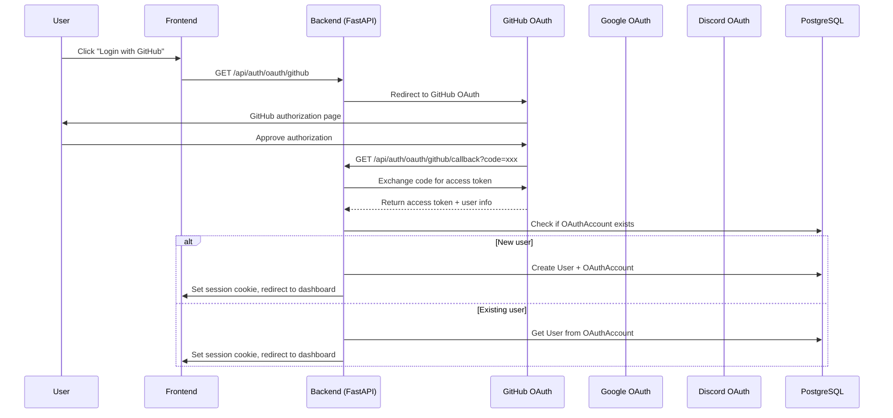

# OAuth Implementation Specification — CriptEnv

## 1. Overview

**Feature**: Social Login via OAuth 2.0 providers (GitHub, Google, Discord)  
**Phase**: Phase 2.5 (OAuth MVP)  
**Status**: Planned  
**Target**: Allow users to sign up/login using their existing GitHub, Google, or Discord accounts

## 2. Architecture

### 2.1 Flow Overview



### 2.2 Supported Providers

| Provider | Scopes Required | User Info Endpoint |
|----------|-----------------|-------------------|
| GitHub | `read:user`, `user:email` | `https://api.github.com/user` |
| Google | `openid`, `email`, `profile` | `https://openidconnect.googleapis.com/v1/userinfo` |
| Discord | `identify`, `email` | `https://discord.com/api/users/@me` |

## 3. Backend Implementation

### 3.1 Dependencies

```python
# requirements.txt
authlib>=1.3.0
httpx>=0.27.0
```

### 3.2 Environment Variables

```bash
# OAuth Providers (already in .env.example)
GITHUB_CLIENT_ID=your_github_client_id
GITHUB_CLIENT_SECRET=your_github_client_secret

GOOGLE_CLIENT_ID=your_google_client_id
GOOGLE_CLIENT_SECRET=your_google_client_secret

DISCORD_CLIENT_ID=your_discord_client_id
DISCORD_CLIENT_SECRET=your_discord_client_secret

# Frontend callback URL (for OAuth redirects)
FRONTEND_URL=http://localhost:3000
```

### 3.3 Database Model

```sql
-- Migration: oauth_accounts
CREATE TABLE oauth_accounts (
    id UUID PRIMARY KEY DEFAULT gen_random_uuid(),
    user_id UUID NOT NULL REFERENCES users(id) ON DELETE CASCADE,
    provider VARCHAR(50) NOT NULL,  -- 'github', 'google', 'discord'
    provider_user_id VARCHAR(255) NOT NULL,  -- ID from the OAuth provider
    provider_email VARCHAR(255),
    access_token TEXT,
    refresh_token TEXT,
    expires_at TIMESTAMPTZ,
    created_at TIMESTAMPTZ DEFAULT NOW(),
    updated_at TIMESTAMPTZ DEFAULT NOW(),
    UNIQUE(provider, provider_user_id),
    UNIQUE(provider, provider_email)
);

CREATE INDEX idx_oauth_accounts_user_id ON oauth_accounts(user_id);
CREATE INDEX idx_oauth_accounts_provider ON oauth_accounts(provider);
```

### 3.4 API Endpoints

#### GET /api/auth/oauth/{provider}

Initiates OAuth flow for the specified provider.

**Path Parameters**:
- `provider`: One of `github`, `google`, `discord`

**Response** (302 Redirect):
```
Location: https://provider.com/oauth/authorize?client_id=xxx&redirect_uri=xxx&scope=xxx&state=xxx
```

#### GET /api/auth/oauth/{provider}/callback

Handles OAuth callback from provider.

**Query Parameters**:
- `code`: Authorization code from provider
- `state`: CSRF state token

**Response** (302 Redirect):
- Success: Redirects to `/{frontend_url}/dashboard?oauth=success`
- Error: Redirects to `/{frontend_url}/login?error=oauth_failed`

### 3.5 File Structure

```
apps/api/
├── app/
│   ├── routers/
│   │   └── oauth.py          # NEW: OAuth routes
│   ├── services/
│   │   └── oauth_service.py  # NEW: OAuth business logic
│   ├── models/
│   │   └── oauth_account.py  # NEW: OAuth account model
│   ├── schemas/
│   │   └── oauth.py          # NEW: OAuth schemas
│   └── middleware/
│       └── oauth.py          # NEW: OAuth state management
└── migrations/
    └── versions/
        └── xxxx_create_oauth_accounts.py
```

### 3.6 OAuth Service Interface

```python
class OAuthProvider(Protocol):
    async def get_authorization_url(self, state: str) -> str: ...
    async def exchange_code(self, code: str) -> dict: ...
    async def get_user_info(self, access_token: str) -> OAuthUserInfo: ...

class OAuthUserInfo(TypedDict):
    id: str
    email: str
    name: str | None
    avatar_url: str | None
```

## 4. Frontend Implementation

### 4.1 Pages

```
apps/web/src/app/(auth)/
├── login/page.tsx           # Add OAuth buttons
├── signup/page.tsx          # Add OAuth buttons
└── oauth/
    └── callback/
        └── page.tsx         # NEW: Handle OAuth callback
```

### 4.2 OAuth Button Component

```tsx
// apps/web/src/components/ui/oauth-button.tsx
interface OAuthButtonProps {
  provider: "github" | "google" | "discord"
  onClick: () => void
  loading?: boolean
}
```

### 4.3 Auth Hook Updates

```typescript
// apps/web/src/hooks/use-auth.ts
interface UseAuth {
  loginWithOAuth: (provider: "github" | "google" | "discord") => Promise<void>
  // ... existing methods
}
```

## 5. Security Considerations

### 5.1 CSRF Protection
- Generate random `state` parameter for each OAuth initiation
- Store state in session cookie before redirect
- Validate state on callback to prevent CSRF

### 5.2 Account Linking
- Allow linking multiple OAuth providers to same account
- Require password verification before linking (future)

### 5.3 Token Storage
- Access tokens stored encrypted in database
- Refresh tokens stored encrypted
- Tokens never exposed to frontend after initial flow

## 6. Implementation Tasks

### Backend Tasks

| Task | Priority | Estimated |
|------|----------|-----------|
| Add Authlib to requirements | P0 | 5 min |
| Create OAuthAccount model | P0 | 15 min |
| Create OAuth migration | P0 | 10 min |
| Implement GitHub OAuth provider | P0 | 1 hour |
| Implement Google OAuth provider | P0 | 1 hour |
| Implement Discord OAuth provider | P0 | 1 hour |
| Create OAuth router | P0 | 30 min |
| Update AuthService for OAuth login | P0 | 30 min |
| Add OAuth tests | P1 | 1 hour |

### Frontend Tasks

| Task | Priority | Estimated |
|------|----------|-----------|
| Create OAuthButton component | P0 | 30 min |
| Add OAuth buttons to login page | P0 | 15 min |
| Add OAuth buttons to signup page | P0 | 15 min |
| Create OAuth callback page | P0 | 30 min |
| Update useAuth hook | P0 | 30 min |
| Add OAuth loading states | P1 | 15 min |
| Add OAuth error handling | P1 | 15 min |

## 7. Testing Strategy

### Unit Tests
- OAuth service provider implementations
- State generation and validation
- User info parsing for each provider

### Integration Tests
- Full OAuth flow with test credentials
- Account linking scenarios
- Error handling (denied access, expired codes)

### E2E Tests (Playwright)
- Login via GitHub
- Login via Google
- Login via Discord
- Signup via GitHub
- Account linking flow

## 8. Environment Setup Guide

### GitHub OAuth App
1. Go to https://github.com/settings/applications/new
2. Application name: `CriptEnv Development`
3. Homepage URL: `http://localhost:3000`
4. Authorization callback URL: `http://localhost:8000/api/auth/oauth/github/callback`
5. Enable Device Flow: `No`

### Google OAuth
1. Go to https://console.cloud.google.com/apis/credentials
2. Create Project > CriptEnv
3. Credentials > Create Credentials > OAuth Client ID
4. Application type: Web application
5. Authorized redirect URIs: `http://localhost:8000/api/auth/oauth/google/callback`

### Discord OAuth
1. Go to https://discord.com/developers/applications
2. New Application > CriptEnv
3. OAuth2 > General
4. Redirects: `http://localhost:8000/api/auth/oauth/discord/callback`
5. Client ID: Copy from General page
6. Client Secret: Generate in OAuth2 page

---

**Document Version**: 1.0  
**Created**: 2026-05-03  
**Status**: Draft — Pending Implementation