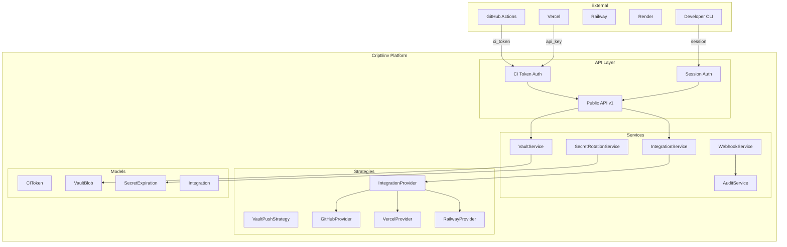
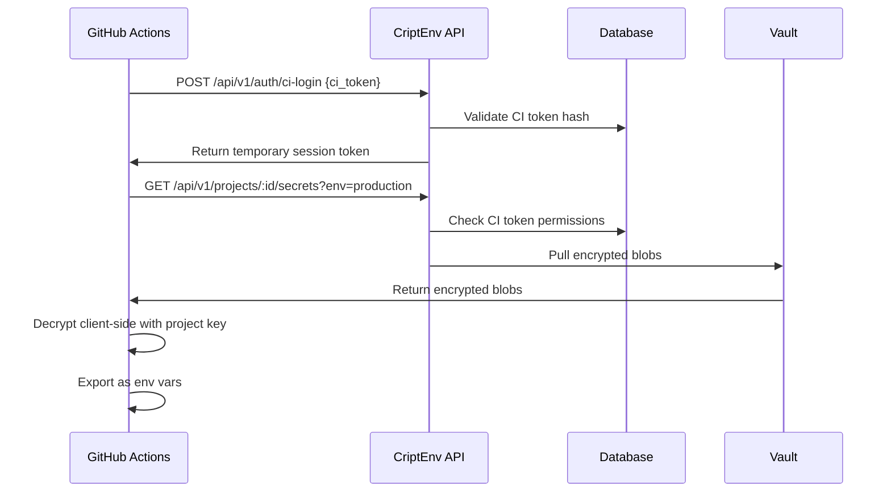
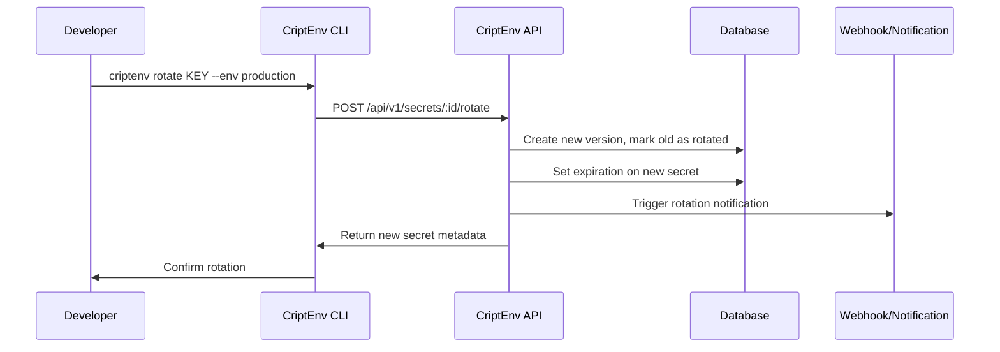
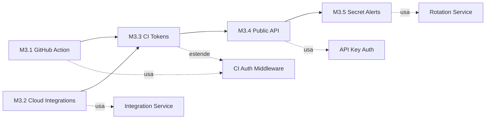

# PHASE-3: CI/CD Integrations & Dynamic Secrets

## Planejamento Completo — HELL Method

---

## 1. HELL Logic Gate (Pré-Implementação)

### 1.1 Information Expert

- **Backend (FastAPI)** detém: CI tokens, projetos, environments, vault blobs, audit logs
- **CLI** detém: sessão local, vault local, configuração de provedores
- **Web** detém: UI de gerenciamento, estado de integrações
- **GitHub Action** precisa de: adapter para consumir API pública do CriptEnv

### 1.2 Pure Fabrication

- `IntegrationService` — media entre CriptEnv e provedores externos (Vercel, Railway, Render)
- `SecretRotationService` — gerencia ciclo de vida e rotação de secrets
- `PublicAPIMiddleware` — camada de autenticação para API pública (API keys vs session tokens)
- `WebhookService` — notificações de expiração e rotação

### 1.3 Protected Variations

- Provedores de CI/CD podem mudar (GitHub → GitLab, Vercel → Netlify)
- API pública precisa ser versionada (`/api/v1/`)
- Tokens CI podem mudar de formato
- Formato de secrets pode variar por provedor

### 1.4 Indirection

- Strategy pattern já existe para `vault_push` → estender para integrações
- `IntegrationProvider` interface abstrai cada provedor externo
- `CIMiddleware` media autenticação via CI tokens (separado de session auth)

### 1.5 Polymorphism

- Diferentes provedores = diferentes adapters (Strategy pattern)
- Diferentes tipos de token (session vs CI vs API key) = diferentes auth strategies
- Diferentes formatos de export por provedor

---

## 2. Estado Atual vs Estado Desejado

### O que JÁ existe (Phase 1-2)

| Componente            | Status | Detalhes                                                   |
| --------------------- | ------ | ---------------------------------------------------------- |
| CI Token model        | ✅     | `CIToken` em `apps/api/app/models/member.py`               |
| CI Token CRUD         | ✅     | Create, list, delete em `apps/api/app/routers/tokens.py`   |
| CI Token hash         | ✅     | SHA-256 hash, prefixo `ci_`                                |
| Auth middleware       | ✅     | Bearer token + cookie em `apps/api/app/middleware/auth.py` |
| Vault push/pull       | ✅     | `VaultService` com versionamento                           |
| Audit logging         | ✅     | `AuditService` com actions padronizadas                    |
| Web integrations page | ⚠️     | Placeholder vazio                                          |
| CLI structure         | ✅     | Click-based, 14 comandos                                   |

### O que PRECISA ser construído

| Componente                              | Prioridade | Milestone |
| --------------------------------------- | ---------- | --------- |
| CI Token auth middleware                | P0         | M3.3      |
| CLI `ci-login` command                  | P0         | M3.3      |
| CLI `ci-deploy` command                 | P0         | M3.3      |
| CLI `ci-secrets` command                | P0         | M3.3      |
| GitHub Action (`@criptenv/action`)      | P0         | M3.1      |
| Public API versioning                   | P0         | M3.4      |
| API documentation (OpenAPI)             | P0         | M3.4      |
| Vercel integration                      | P0         | M3.2      |
| Railway integration                     | P1         | M3.2      |
| Render integration                      | P1         | M3.2      |
| Secret expiration model                 | P1         | M3.5      |
| Secret alerts/notifications             | P1         | M3.5      |
| Secret rotation basics                  | P1         | M3.5      |
| Web integrations dashboard              | P1         | M3.2      |
| Rate limiting (pré-requisito segurança) | P0         | M3.4      |

---

## 3. Arquitetura Proposta

### 3.1 Diagrama de Componentes



### 3.2 Fluxo: GitHub Action



### 3.3 Fluxo: Secret Rotation



---

## 4. Milestones Detalhados

### M3.1: GitHub Action (Semanas 1-4)

**Critério de aceite**: Action publicado no GitHub Marketplace

#### Tasks

| #     | Task                                        | Arquivo(s)                            | Dependência  |
| ----- | ------------------------------------------- | ------------------------------------- | ------------ |
| 3.1.1 | Criar middleware de autenticação CI token   | `apps/api/app/middleware/ci_auth.py`  | —            |
| 3.1.2 | Criar endpoint `POST /api/v1/auth/ci-login` | `apps/api/app/routers/auth.py`        | 3.1.1        |
| 3.1.3 | Criar endpoint `GET /api/v1/ci/secrets`     | `apps/api/app/routers/ci.py`          | 3.1.1        |
| 3.1.4 | Criar GitHub Action (`action.yml`)          | `packages/github-action/action.yml`   | 3.1.2, 3.1.3 |
| 3.1.5 | Implementar action logic (Node.js)          | `packages/github-action/src/index.ts` | 3.1.4        |
| 3.1.6 | Testes E2E do action                        | `packages/github-action/__tests__/`   | 3.1.5        |
| 3.1.7 | Documentação + README                       | `packages/github-action/README.md`    | 3.1.6        |
| 3.1.8 | Publicar no GitHub Marketplace              | —                                     | 3.1.7        |

#### Detalhes Técnicos

**3.1.1 — CI Auth Middleware**

```python
# apps/api/app/middleware/ci_auth.py
# Similar ao auth.py existente, mas valida CI token ao invés de session
# Fluxo: Authorization: Bearer ci_xxxxx → hash → busca em ci_tokens table
# Retorna: CIToken object (não User) + project_id associado
# Valida: expires_at, last_used_at update
```

**3.1.2 — CI Login Endpoint**

```
POST /api/v1/auth/ci-login
Body: { "token": "ci_xxxxx" }
Response: { "session_token": "...", "project_id": "...", "expires_in": 3600 }
```

**3.1.3 — CI Secrets Endpoint**

```
GET /api/v1/ci/secrets?environment=production
Headers: Authorization: Bearer <ci_session_token>
Response: { "blobs": [...], "version": 5 }
```

**3.1.4-3.1.5 — GitHub Action**

```yaml
# action.yml
name: "CriptEnv Secrets"
description: "Pull secrets from CriptEnv and inject as environment variables"
inputs:
  token:
    description: "CI token from CriptEnv"
    required: true
  environment:
    description: "Environment name (e.g., production)"
    required: false
    default: "production"
  project:
    description: "Project ID"
    required: true
outputs:
  secrets_count:
    description: "Number of secrets loaded"
runs:
  using: "node20"
  main: "dist/index.js"
```

---

### M3.2: Cloud Integrations (Semanas 3-6)

**Critério de aceite**: Vercel + Railway funcionando com sync automático

#### Tasks

| #      | Task                                            | Arquivo(s)                                           | Dependência  |
| ------ | ----------------------------------------------- | ---------------------------------------------------- | ------------ |
| 3.2.1  | Criar `IntegrationProvider` interface           | `apps/api/app/strategies/integrations.py`            | —            |
| 3.2.2  | Criar model `Integration`                       | `apps/api/app/models/integration.py`                 | —            |
| 3.2.3  | Criar schema `Integration`                      | `apps/api/app/schemas/integration.py`                | 3.2.2        |
| 3.2.4  | Criar `IntegrationService`                      | `apps/api/app/services/integration_service.py`       | 3.2.1, 3.2.2 |
| 3.2.5  | Criar router de integrações                     | `apps/api/app/routers/integrations.py`               | 3.2.4        |
| 3.2.6  | Implementar `VercelProvider`                    | `apps/api/app/strategies/integrations/vercel.py`     | 3.2.1        |
| 3.2.7  | Implementar `RailwayProvider`                   | `apps/api/app/strategies/integrations/railway.py`    | 3.2.1        |
| 3.2.8  | Implementar `RenderProvider`                    | `apps/api/app/strategies/integrations/render.py`     | 3.2.1        |
| 3.2.9  | CLI: `criptenv integrations list`               | `apps/cli/src/criptenv/commands/integrations.py`     | 3.2.5        |
| 3.2.10 | CLI: `criptenv integrations connect <provider>` | `apps/cli/src/criptenv/commands/integrations.py`     | 3.2.5        |
| 3.2.11 | CLI: `criptenv integrations sync`               | `apps/cli/src/criptenv/commands/integrations.py`     | 3.2.5        |
| 3.2.12 | Web: Dashboard de integrações                   | `apps/web/src/app/(dashboard)/integrations/page.tsx` | 3.2.5        |
| 3.2.13 | Testes de integração                            | `apps/api/tests/test_integration_*`                  | 3.2.5        |

#### Detalhes Técnicos

**3.2.1 — IntegrationProvider Interface**

```python
# apps/api/app/strategies/integrations/base.py
from abc import ABC, abstractmethod

class IntegrationProvider(ABC):
    """Strategy interface for external CI/CD providers."""

    @abstractmethod
    async def push_secrets(self, secrets: dict, config: dict) -> bool:
        """Push secrets to external provider."""
        ...

    @abstractmethod
    async def pull_secrets(self, config: dict) -> dict:
        """Pull current secrets from external provider."""
        ...

    @abstractmethod
    async def validate_connection(self, config: dict) -> bool:
        """Validate that the connection is still active."""
        ...

    @abstractmethod
    def get_provider_name(self) -> str:
        """Return provider identifier."""
        ...
```

**3.2.2 — Integration Model**

```python
# apps/api/app/models/integration.py
class Integration(Base):
    __tablename__ = "integrations"

    id = Column(UUID, primary_key=True)
    project_id = Column(UUID, ForeignKey("projects.id"), index=True)
    provider = Column(String(50), nullable=False)  # vercel, railway, render
    config = Column(JSONB, nullable=False)  # provider-specific config
    status = Column(String(20), default="active")  # active, disconnected, error
    last_sync_at = Column(DateTime)
    created_at = Column(DateTime, server_default=func.now())
    updated_at = Column(DateTime, onupdate=func.now())
```

**3.2.6 — Vercel Provider (exemplo)**

```python
# apps/api/app/strategies/integrations/vercel.py
class VercelProvider(IntegrationProvider):
    """Integration with Vercel environment variables API."""

    VERCEL_API = "https://api.vercel.com"

    async def push_secrets(self, secrets: dict, config: dict) -> bool:
        # POST /v10/projects/{project_id}/env
        # Each secret becomes a Vercel env var
        ...

    async def pull_secrets(self, config: dict) -> dict:
        # GET /v9/projects/{project_id}/env
        ...

    async def validate_connection(self, config: dict) -> bool:
        # GET /v2/user with bearer token
        ...
```

---

### M3.3: CI Tokens Enhancement (Semanas 5-8)

**Critério de aceite**: Token-based auth completo para CI/CD

#### Tasks

| #     | Task                                    | Arquivo(s)                                                     | Dependência |
| ----- | --------------------------------------- | -------------------------------------------------------------- | ----------- |
| 3.3.1 | Adicionar scopes/permissions ao CIToken | `apps/api/app/models/member.py`                                | —           |
| 3.3.2 | Criar schema de scopes                  | `apps/api/app/schemas/member.py`                               | 3.3.1       |
| 3.3.3 | Middleware de validação de scopes       | `apps/api/app/middleware/ci_auth.py`                           | 3.3.1       |
| 3.3.4 | CLI: `criptenv ci-login`                | `apps/cli/src/criptenv/commands/ci.py`                         | 3.1.2       |
| 3.3.5 | CLI: `criptenv ci-deploy`               | `apps/cli/src/criptenv/commands/ci.py`                         | 3.3.4       |
| 3.3.6 | CLI: `criptenv ci-secrets`              | `apps/cli/src/criptenv/commands/ci.py`                         | 3.3.4       |
| 3.3.7 | Web: CI Tokens management UI            | `apps/web/src/app/(dashboard)/projects/[id]/settings/page.tsx` | 3.3.2       |
| 3.3.8 | Testes de CI auth flow                  | `apps/api/tests/test_ci_auth.py`                               | 3.3.3       |

#### Detalhes Técnicos

**3.3.1 — Scopes no CIToken**

```python
# Adicionar ao model CIToken:
scopes = Column(JSONB, default=["read:secrets"])  # read:secrets, write:secrets, read:audit
environment_scope = Column(String(255))  # null = all, or specific env name
```

**3.3.4-3.3.6 — CLI CI Commands**

```bash
# Login com CI token (salva no vault local como session especial)
criptenv ci-login --token ci_xxxxxx

# Deploy: push secrets e opcionalmente sync com provedor
criptenv ci-deploy --env production --provider vercel

# Listar secrets disponíveis no contexto CI
criptenv ci-secrets --env production
```

---

### M3.4: Public API (Semanas 7-10)

**Critério de aceite**: REST API documentada e versionada

#### Tasks

| #      | Task                                    | Arquivo(s)                                | Dependência |
| ------ | --------------------------------------- | ----------------------------------------- | ----------- |
| 3.4.1  | Versionar API com prefixo `/api/v1/`    | `apps/api/main.py`                        | —           |
| 3.4.2  | Criar API key model                     | `apps/api/app/models/api_key.py`          | —           |
| 3.4.3  | Criar API key router                    | `apps/api/app/routers/api_keys.py`        | 3.4.2       |
| 3.4.4  | Middleware de autenticação por API key  | `apps/api/app/middleware/api_key_auth.py` | 3.4.2       |
| 3.4.5  | Rate limiting middleware                | `apps/api/app/middleware/rate_limit.py`   | —           |
| 3.4.6  | Configurar OpenAPI/Swagger customizado  | `apps/api/main.py`                        | 3.4.1       |
| 3.4.7  | Documentar todos os endpoints           | `docs/api/README.md`                      | 3.4.6       |
| 3.4.8  | Criar endpoint de health com versioning | `apps/api/app/routers/health.py`          | 3.4.1       |
| 3.4.9  | Testes de rate limiting                 | `apps/api/tests/test_rate_limit.py`       | 3.4.5       |
| 3.4.10 | Testes de API key auth                  | `apps/api/tests/test_api_key_auth.py`     | 3.4.4       |

#### Detalhes Técnicos

**3.4.2 — API Key Model**

```python
class APIKey(Base):
    __tablename__ = "api_keys"

    id = Column(UUID, primary_key=True)
    user_id = Column(UUID, ForeignKey("users.id"), index=True)
    name = Column(String(255), nullable=False)
    key_hash = Column(String(255), nullable=False, unique=True)
    prefix = Column(String(10), nullable=False)  # "cek_" prefix for display
    scopes = Column(JSONB, default=["read"])
    last_used_at = Column(DateTime)
    expires_at = Column(DateTime)
    created_at = Column(DateTime, server_default=func.now())
```

**3.4.5 — Rate Limiting**

```python
# apps/api/app/middleware/rate_limit.py
# Usar slowapi ou implementação custom com Redis/in-memory
# Limites sugeridos:
# - Auth endpoints: 5 req/min por IP
# - API key endpoints: 100 req/min por key
# - CI endpoints: 200 req/min por token
# - General: 1000 req/min por user
```

---

### M3.5: Secret Alerts & Rotation (Semanas 9-12)

**Critério de aceite**: Notificações de expiração e rotação básica

#### Tasks

| #      | Task                                               | Arquivo(s)                                                     | Dependência |
| ------ | -------------------------------------------------- | -------------------------------------------------------------- | ----------- |
| 3.5.1  | Criar model `SecretExpiration`                     | `apps/api/app/models/secret_expiration.py`                     | —           |
| 3.5.2  | Criar schema de expiração                          | `apps/api/app/schemas/secret_expiration.py`                    | 3.5.1       |
| 3.5.3  | Criar `SecretRotationService`                      | `apps/api/app/services/rotation_service.py`                    | 3.5.1       |
| 3.5.4  | Criar router de rotação                            | `apps/api/app/routers/rotation.py`                             | 3.5.3       |
| 3.5.5  | Background job: verificação de expirações          | `apps/api/app/jobs/expiration_check.py`                        | 3.5.1       |
| 3.5.6  | Webhook/notification service                       | `apps/api/app/services/webhook_service.py`                     | —           |
| 3.5.7  | CLI: `criptenv rotate KEY`                         | `apps/cli/src/criptenv/commands/secrets.py`                    | 3.5.4       |
| 3.5.8  | CLI: `criptenv secrets expire KEY --days 90`       | `apps/cli/src/criptenv/commands/secrets.py`                    | 3.5.4       |
| 3.5.9  | Web: Indicadores de expiração na tabela de secrets | `apps/web/src/components/shared/secret-row.tsx`                | 3.5.2       |
| 3.5.10 | Web: Configuração de alertas por projeto           | `apps/web/src/app/(dashboard)/projects/[id]/settings/page.tsx` | 3.5.6       |
| 3.5.11 | Testes de rotação                                  | `apps/api/tests/test_rotation.py`                              | 3.5.3       |

#### Detalhes Técnicos

**3.5.1 — SecretExpiration Model**

```python
class SecretExpiration(Base):
    __tablename__ = "secret_expirations"

    id = Column(UUID, primary_key=True)
    project_id = Column(UUID, ForeignKey("projects.id"), index=True)
    environment_id = Column(UUID, ForeignKey("environments.id"), index=True)
    secret_key = Column(String(255), nullable=False)  # key_id in vault_blobs
    expires_at = Column(DateTime, nullable=False)
    rotation_policy = Column(String(20), default="manual")  # manual, auto, notify
    notify_days_before = Column(Integer, default=7)
    last_notified_at = Column(DateTime)
    rotated_at = Column(DateTime)
    created_at = Column(DateTime, server_default=func.now())
```

---

## 5. Estrutura de Diretórios Resultante

```
criptenv/
├── apps/
│   ├── api/
│   │   ├── app/
│   │   │   ├── middleware/
│   │   │   │   ├── auth.py              (existente)
│   │   │   │   ├── ci_auth.py           (NOVO - M3.1)
│   │   │   │   ├── api_key_auth.py      (NOVO - M3.4)
│   │   │   │   └── rate_limit.py        (NOVO - M3.4)
│   │   │   ├── models/
│   │   │   │   ├── integration.py       (NOVO - M3.2)
│   │   │   │   ├── api_key.py           (NOVO - M3.4)
│   │   │   │   └── secret_expiration.py (NOVO - M3.5)
│   │   │   ├── routers/
│   │   │   │   ├── ci.py                (NOVO - M3.1)
│   │   │   │   ├── integrations.py      (NOVO - M3.2)
│   │   │   │   ├── api_keys.py          (NOVO - M3.4)
│   │   │   │   └── rotation.py          (NOVO - M3.5)
│   │   │   ├── schemas/
│   │   │   │   ├── integration.py       (NOVO - M3.2)
│   │   │   │   ├── api_key.py           (NOVO - M3.4)
│   │   │   │   └── secret_expiration.py (NOVO - M3.5)
│   │   │   ├── services/
│   │   │   │   ├── integration_service.py (NOVO - M3.2)
│   │   │   │   ├── rotation_service.py    (NOVO - M3.5)
│   │   │   │   └── webhook_service.py     (NOVO - M3.5)
│   │   │   ├── strategies/
│   │   │   │   └── integrations/        (NOVO - M3.2)
│   │   │   │       ├── base.py
│   │   │   │       ├── vercel.py
│   │   │   │       ├── railway.py
│   │   │   │       └── render.py
│   │   │   └── jobs/
│   │   │       └── expiration_check.py  (NOVO - M3.5)
│   │   └── tests/
│   │       ├── test_ci_auth.py          (NOVO)
│   │       ├── test_integration_*.py    (NOVO)
│   │       ├── test_api_key_auth.py     (NOVO)
│   │       ├── test_rate_limit.py       (NOVO)
│   │       └── test_rotation.py         (NOVO)
│   ├── cli/
│   │   └── src/criptenv/
│   │       └── commands/
│   │           ├── ci.py                (NOVO - M3.3)
│   │           └── integrations.py      (NOVO - M3.2)
│   └── web/
│       └── src/
│           ├── app/(dashboard)/
│           │   └── integrations/
│           │       └── page.tsx          (REWRITE - M3.2)
│           └── lib/api/
│               └── integrations.ts       (NOVO - M3.2)
├── packages/
│   └── github-action/                    (NOVO - M3.1)
│       ├── action.yml
│       ├── package.json
│       ├── src/index.ts
│       ├── __tests__/
│       └── README.md
├── docs/
│   └── api/
│       └── README.md                     (NOVO - M3.4)
└── plans/
    └── phase3-cicd-integrations.md       (ESTE DOCUMENTO)
```

---

## 6. Dependências e Ordem de Implementação



### Ordem Recomendada de Execução

1. **Semana 1-2**: Infraestrutura compartilhada
   - CI Auth Middleware (3.1.1)
   - Integration model + provider interface (3.2.1, 3.2.2, 3.2.3)
   - Rate limiting middleware (3.4.5)

2. **Semana 3-4**: GitHub Action + CI endpoints
   - CI Login endpoint (3.1.2)
   - CI Secrets endpoint (3.1.3)
   - GitHub Action implementation (3.1.4-3.1.7)

3. **Semana 5-6**: Cloud integrations
   - IntegrationService (3.2.4, 3.2.5)
   - Vercel + Railway providers (3.2.6, 3.2.7)
   - CLI integration commands (3.2.9-3.2.11)
   - Web integrations dashboard (3.2.12)

4. **Semana 7-8**: CI tokens enhancement + Public API
   - CIToken scopes (3.3.1-3.3.3)
   - CLI CI commands (3.3.4-3.3.6)
   - API versioning + API keys (3.4.1-3.4.4)
   - OpenAPI docs (3.4.6, 3.4.7)

5. **Semana 9-10**: Secret alerts & rotation
   - SecretExpiration model (3.5.1, 3.5.2)
   - Rotation service (3.5.3, 3.5.4)
   - Background jobs (3.5.5)
   - Webhook service (3.5.6)

6. **Semana 11-12**: Polish & launch
   - CLI rotation commands (3.5.7, 3.5.8)
   - Web expiration UI (3.5.9, 3.5.10)
   - Testes E2E completos
   - Documentação final
   - GitHub Marketplace publish (3.1.8)

---

## 7. Pré-requisitos de Segurança (do Phase 2 Review)

Antes de iniciar Phase 3, estes issues do PHASE2-REVIEW.md devem ser resolvidos:

| Issue                                 | Prioridade | Impacto na Phase 3                   |
| ------------------------------------- | ---------- | ------------------------------------ |
| CR-01: Session token em response body | P0         | API pública não pode expor tokens    |
| CR-02: Token em localStorage          | P0         | XSS risk em dashboard de integrações |
| MR-03: Rate limiting ausente          | P1         | Pré-requisito para API pública       |
| HR-01: Escalation via invites         | P1         | Segurança de CI tokens depende disso |

---

## 8. Critérios de Sucesso (Phase 3)

```
- GitHub Action: published, 100+ installs
- Integrations: Vercel + Railway working
- CI Tokens: used in 50+ repositories
- Public API: documented, 99.9% uptime
- Secret Rotation: adopted by 30% of projects
- Rate Limiting: 0 abuse incidents
- Test Coverage: > 85% for new code
```

---

## 9. Riscos e Mitigações

| Risco                     | Probabilidade | Impacto | Mitigação                         |
| ------------------------- | ------------- | ------- | --------------------------------- |
| Vercel API changes        | Média         | Alto    | Strategy pattern abstrai provedor |
| CI token leakage          | Baixa         | Crítico | Token rotation + scopes limitados |
| Rate limit bypass         | Baixa         | Alto    | IP + token based limiting         |
| GitHub Action bugs        | Média         | Alto    | E2E tests + canary releases       |
| Secret rotation data loss | Baixa         | Crítico | Versionamento + rollback          |

---

**Document Version**: 1.0
**Created**: 2026-04-30
**Status**: PLANNING — Aguardando aprovação
**Next**: HELL:spec para cada milestone
